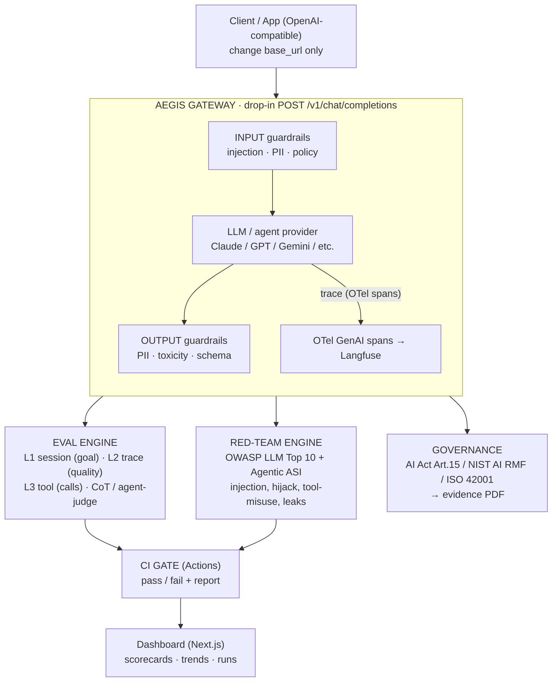

# 🛡️ Aegis

**Español** · [English](README.md)

**La capa de control para cualquier LLM o agente** — un gateway compatible con OpenAI,
*drop-in*, que añade guardrails, evals de trayectoria en 3 niveles con un juez calibrado
contra humanos, cobertura de red-team OWASP, trazas con OpenTelemetry, evidencia de
gobernanza y un *CI gate* que bloquea regresiones.

> Los **comandos y ejemplos ejecutables** (Quickstart, CLI de cada sección, demo) viven en
> el [README en inglés](README.md), que es la versión canónica — así nunca se desincronizan
> con el código. Este documento explica **qué** es Aegis y **por qué** importa.

## De un vistazo

- **Offline por defecto** — 900+ tests, **mock provider + mock judge** deterministas y sin claves; sin API key ni red en CI. El **Claude** real y un **juez inspirado en G-Eval** real entran detrás de las mismas interfaces (ABCs).
- **Guardrails (F2)** — inyección de prompts (OWASP LLM01), redacción de PII, política allow/deny, toxicidad — **desactivados por defecto**, *passthrough* idéntico byte a byte cuando están off.
- **Evals (F3–F5)** — L1/L2/L3 + métricas de trayectoria + CLEAR; acuerdo del juez con etiquetas humanas **Cohen's κ ≈ 0,93** (direccional).
- **Red-team (F6–F7)** — catálogo de ataques **OWASP-LLM-2025** commiteado; detección por categoría con los **gaps nombrados, no escondidos** (cobertura contra catálogo, no una nota de seguridad).
- **Dos *CI gates* de regresión** — `aegis eval gate` + `aegis redteam gate`, deterministas y totalmente offline.
- **Gobernanza (F8)** — evidencia mapeada a **EU AI Act Art.15 / NIST AI RMF / ISO 42001**, derivada de artefactos reales — evidencia técnica parcial, no un certificado de cumplimiento.

> **Estado — pre-alpha, proyecto de portfolio.** F0–F9 completas y testeadas offline. El mock provider/judge sin claves es el valor por defecto, así que todo corre sin API key. Detalle por fase en la [hoja de ruta del README en inglés](README.md#roadmap-phased).

---

## Por qué

Un único cambio *drop-in* (`base_url`) le da a una app existente guardrails, trazas de petición y evals continuos — **sin tocar su modelo ni su lógica de negocio**. Aegis no es un modelo; es la **capa de control** alrededor de cualquier modelo o agente.

El diferenciador es la **profundidad de evaluación**: no solo puntuar la salida final, sino puntuar la *trayectoria* (cada llamada a herramienta, en orden, recuperándose de errores), validar el juez LLM contra etiquetas humanas, y cablearlo todo en un *CI gate* para que las regresiones **bloqueen el merge** en vez de llegar a producción.

---

## Arquitectura

**Flujo:** `gateway → guardrails → provider → evals / red-team → CI gate`.

---

## Capacidades

> Para el detalle técnico completo de cada bloque (con sus *caveats* de honestidad y los
> comandos), ve a la sección correspondiente del [README en inglés](README.md).

**Guardrails (F2).** Inyección de prompts (OWASP LLM01), redacción de PII, política allow/deny y toxicidad, tanto en entrada como en salida. Están **off por defecto**: con ellos apagados, el gateway es un *passthrough* idéntico byte a byte. → [detalle](README.md#guardrails-f2)

**Provider real — Anthropic / Claude.** El Claude real entra por carga perezosa detrás de la misma ABC `Provider`, que está lista para multi-provider (OpenAI/Gemini son *seams* de interfaz, aún no implementados). → [detalle](README.md#real-provider--anthropic--claude)

**Evals (F3) + trayectoria / CLEAR (F4).** Métricas L1/L2/L3 más puntuación de *trayectoria* (cada llamada a herramienta, en orden) y CLEAR. El juez de trayectoria mock es una **heurística ilustrativa, no un juez semántico** — señal para cazar regresiones, no *ground truth*. → [detalle](README.md#evals-f3)

**Calibración del juez (F5).** El juez LLM se trata como **direccional** y se valida contra etiquetas humanas con **Cohen's κ**, reportado con `p_o` y la matriz de confusión, sobre N=30 de un solo anotador — un CI ancho, no un veredicto preciso. El valor es que **el gate caza regresiones**, no que el juez sea verdad absoluta. → [detalle](README.md#judge-calibration-f5)

**Red-team (F6).** Catálogo de ataques sintéticos commiteado, mapeado a OWASP-LLM-2025, con detección por categoría y los **gaps nombrados, no escondidos** (es cobertura contra catálogo, no una nota de seguridad). → [detalle](README.md#automated-red-team-f6)

**CI gate (F7) — evals + red-team.** Dos *gates* deterministas y offline (`aegis eval gate` + `aegis redteam gate`) que bloquean el PR ante una regresión frente al *baseline* commiteado. **Es el feature estrella.** → [detalle](README.md#ci-regression-gate-f7--evals--red-team)

**Observabilidad — OpenTelemetry (F1.x).** Un *span* de OTel por petición siguiendo las convenciones semánticas GenAI (~v1.38). **Opt-in y no-op por defecto**, y por privacidad los *spans* llevan **solo metadatos** (modelo, tokens, duración), **nunca contenido de mensajes** — para no re-filtrar la PII que los guardrails quitan. → [detalle](README.md#observability--opentelemetry-tracing-f1x)

**Evidencia de gobernanza (F8).** `aegis evidence` mapea los artefactos reales que Aegis ya produce a controles concretos de EU AI Act Art.15 / NIST AI RMF / ISO 42001. **No es un certificado**: cada estado se **deriva de un campo real** en tiempo de generación, nunca se escribe a mano; sin artefacto, el control queda `not_covered`. La mayoría de las cláusulas de cada marco están explícitamente fuera de alcance. → [detalle](README.md#governance-evidence-f8)

**Dashboard (F9).** Panel **de solo lectura** (Next.js + Recharts) que visualiza los reports reales que Aegis escribe. **Nunca más optimista que los reports**: un report ausente se muestra como **"Not available"** con el comando para generarlo, nunca un gráfico en blanco o falseado; los estados se muestran **verbatim**. → [detalle](README.md#dashboard-f9)

---

## Stack técnico

| Capa | Tecnología |
|------|------------|
| API gateway | FastAPI + uvicorn (endpoint compatible con OpenAI) |
| Provider real | SDK de Anthropic (perezoso, extra opcional `[anthropic]`); la ABC `Provider` está lista para multi-provider — OpenAI/Gemini son *seams* de interfaz, aún no implementados |
| Guardrails | escáneres deterministas regex/léxico (por defecto, sin claves); Microsoft **Presidio** opcional para PII más rica (`[guardrails]`) |
| Evals y juez | juez CoT inspirado en G-Eval (Anthropic), métricas de 3 niveles + trayectoria, Agent-as-a-Judge (backend *stub*) |
| Red-team | catálogo de ataques sintéticos commiteado, mapeado a OWASP LLM 2025 (`redteam run` + `redteam gate`) |
| Observabilidad | OpenTelemetry GenAI semconv (~v1.38); OTLP → Langfuse opcional (`[otel]`) |
| Persistencia | reports JSON en disco (`reports/`, en gitignore) — sin base de datos |
| Dashboard | Next.js + React + Recharts (solo lectura, lectura en servidor) |
| Gobernanza | PDF de evidencia con `fpdf2` + *sidecar* JSON (opcional `[reporting]`) |
| CI | GitHub Actions — *gates* de regresión `eval-gate` + `redteam-gate`, totalmente offline |

---

## Honestidad

Esto es un **proyecto de portfolio**, no un producto con clientes. Las cifras reportadas son medidas reales sobre el *golden set* del propio proyecto — sin claims inflados. El juez LLM se trata como *direccional* y se **valida contra etiquetas humanas con Cohen's κ** ([calibración del juez (F5)](README.md#judge-calibration-f5)) — reportado con `p_o` y la matriz de confusión, sobre N=30 de un solo anotador, así que κ se lee como una señal direccional de CI ancho, no como un veredicto preciso; la propuesta de valor es que **el gate caza regresiones**, no que un juez sea *ground truth*. Los guardrails son defensa en profundidad con cobertura mapeada a OWASP — no una afirmación de detección total.

---

## Licencia

[MIT](LICENSE) © 2026 Marcos Mata García
