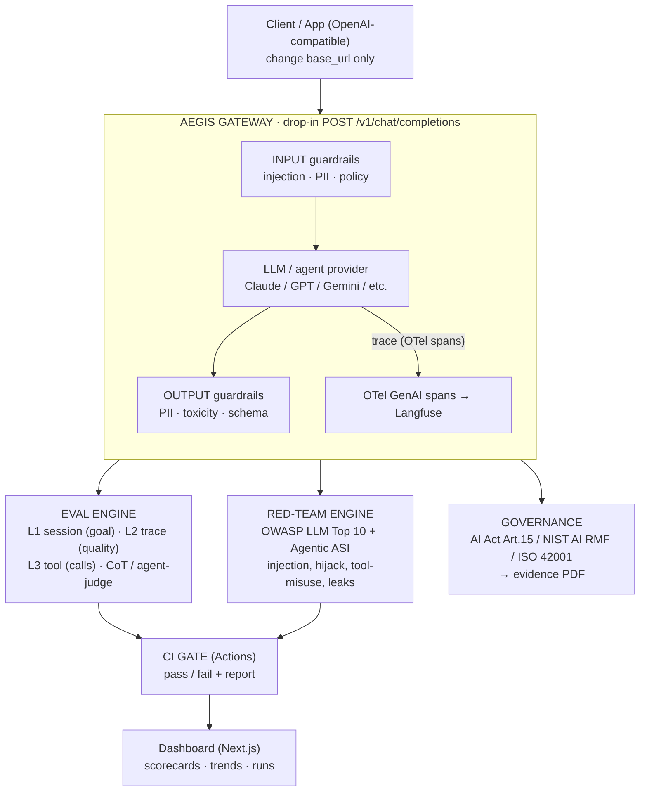

<div align="center">

# 🛡️ Aegis

**Español** · [English](README.md)

**La capa de control para cualquier LLM o agente** — un gateway compatible con OpenAI,
*drop-in*, que añade guardrails, evals de trayectoria en 3 niveles con un juez calibrado
contra etiquetas humanas, cobertura red-team OWASP, trazas OpenTelemetry, evidencia de
gobernanza y dos *CI gates* que **bloquean el merge** ante una regresión de evals o de red-team.

[](https://github.com/marcosmatalab/aegis/actions/workflows/ci.yml)
[](https://pypi.org/project/aegis-control-plane/)
[](https://github.com/marcosmatalab/aegis/releases)
[](LICENSE)
[](https://github.com/marcosmatalab/aegis/actions/workflows/ci.yml)


</div>

---

Hecho por **Marcos Mata García**, ingeniero de IA / plataforma en Madrid, buscando trabajo
ahora mismo.
[LinkedIn](https://linkedin.com/in/marcosmatagarcia) · [matagarciamarcos@gmail.com](mailto:matagarciamarcos@gmail.com) · [GitHub](https://github.com/marcosmatalab)

**Por qué existe esto.** Todo equipo que mete un LLM en producción acaba construyendo a mano
la misma capa: algo que escanea la entrada, tapa la PII, puntúa si el agente hizo de verdad
el trabajo, hace red-team contra sus propios guardrails, e impide que una regresión llegue a
producción. Construí esa capa de punta a punta para poder discutirla desde la evidencia y no
desde la opinión. Lo que importa aquí es el **gate de evals** y la **calibración del juez**;
lo demás es fontanería alrededor.

---


<sub>Renderizado a partir de la **salida real** de una ejecución offline con
[`scripts/capture_demo.sh`](scripts/capture_demo.sh) +
[`scripts/render_demo_gif.py`](scripts/render_demo_gif.py): cada cifra en pantalla la imprimió
una herramienta de verdad. El FAIL del gate es una regresión genuina, provocada rompiendo a
propósito el scorer L3.</sub>

## De un vistazo

- **Offline por defecto** — **944 tests, 96% de cobertura de rama**, **mock provider + mock judge** deterministas y sin claves; sin API key ni red en CI. El **Claude** real y un **juez inspirado en G-Eval** real entran detrás de las mismas ABCs. Compruébalo: `pytest -q`
- **Guardrails (F2)** — inyección de prompts (OWASP LLM01), redacción de PII, política allow/deny, toxicidad — **off por defecto**, *passthrough* idéntico byte a byte cuando están apagados. [Detalle](docs/guardrails.md)
- **Un juez calibrado contra etiquetas humanas (F3–F5)** — L1/L2/L3 + métricas de trayectoria + CLEAR, y **Cohen's κ = 0,933** sobre 30 casos etiquetados a mano (direccional; N=30, un solo anotador). Los 30 veredictos caso a caso están **commiteados**, así que lo recomputas offline y sin clave. [Detalle](docs/evals.md)
- **Red-team (F6–F7)** — catálogo de ataques **OWASP-LLM-2025** commiteado; **18/25 detectados** y los **7 que pasan están nombrados**, no redondeados. Es cobertura contra catálogo, no una nota de seguridad. Compruébalo: `aegis redteam run`. [Detalle](docs/redteam.md)
- **Dos gates de regresión en CI** — `aegis eval gate` + `aegis redteam gate` convierten una regresión en un evento nombrado, bloqueante y revisable dentro del PR. Deterministas, offline y sin claves. [Detalle](docs/ci-gates.md)
- **Gobernanza (F8)** — evidencia mapeada a **EU AI Act Art.15 / NIST AI RMF / ISO 42001**, derivada de artefactos reales — evidencia técnica parcial, no un certificado de cumplimiento. [Detalle](docs/governance.md)
- **Dashboard de solo lectura (F9)** — muestra los reports reales y nunca es más optimista que ellos; un report ausente sale como *Not available*, nunca un gráfico en blanco. **[Míralo en vivo](https://marcosmatalab.github.io/aegis/)** (instantánea estática de una ejecución real, y lo dice en la propia página) · [Capturas](docs/dashboard.md)

> **Estado — pre-alpha, proyecto de portfolio.** F0–F9 completas y testeadas offline. El mock provider/judge sin claves sigue siendo el valor por defecto, así que todo corre sin API key. Detalle por fase en la [hoja de ruta](docs/roadmap.md).

## Contenido

**Esta página:** [Por qué](#por-qué) · [Arquitectura](#arquitectura) · [Los números](#los-números-y-cómo-los-reproduces) · [Demo](#demo) · [Quickstart](#quickstart) · [Gates de CI](#gates-de-regresión-en-ci-f7) · [Procedencia](#procedencia-cómo-se-construyó-esto)

**En profundidad, en [`docs/`](docs/)** (en inglés): [Guardrails](docs/guardrails.md) · [Provider real](docs/provider-anthropic.md) · [Evals, trayectoria y calibración](docs/evals.md) · [Red-team](docs/redteam.md) · [Los gates al completo](docs/ci-gates.md) · [Observabilidad](docs/observability.md) · [Gobernanza](docs/governance.md) · [Dashboard](docs/dashboard.md) · [Hoja de ruta](docs/roadmap.md)

---

## Por qué

Un único cambio *drop-in* (`base_url`) le da a una app existente guardrails, trazas de petición
y evals continuos, sin tocar su modelo ni su lógica de negocio. Aegis no es un modelo; es la
**capa de control** alrededor de cualquier modelo o agente.

El diferenciador es la **profundidad de evaluación**: no solo puntuar la salida final, sino
puntuar la *trayectoria* (cada llamada a herramienta, en orden, recuperándose de errores),
validar el juez LLM contra etiquetas humanas, y cablearlo todo en dos gates de CI que son
**checks obligatorios en `main`**: una regresión se convierte en un evento nombrado, que
bloquea el merge y es revisable dentro del PR, en vez de algo que llega a producción.

---

## Arquitectura


```mermaid
flowchart TD
    client["Client / App (OpenAI-compatible)<br/>change base_url only"]

    subgraph gateway["AEGIS GATEWAY · drop-in POST /v1/chat/completions"]
        direction TB
        guard_in["INPUT guardrails<br/>injection · PII · policy"]
        provider["LLM / agent provider<br/>Claude / GPT / Gemini / etc."]
        guard_out["OUTPUT guardrails<br/>PII · toxicity · schema"]
        otel["OTel GenAI spans → Langfuse"]
        guard_in --> provider --> guard_out
        provider -- "trace (OTel spans)" --> otel
    end

    client --> gateway

    eval["EVAL ENGINE<br/>L1 session (goal) · L2 trace (quality)<br/>L3 tool (calls) · CoT / agent-judge"]
    redteam["RED-TEAM ENGINE<br/>OWASP LLM Top 10 + Agentic ASI<br/>injection, hijack, tool-misuse, leaks"]
    governance["GOVERNANCE<br/>AI Act Art.15 / NIST AI RMF / ISO 42001<br/>→ evidence PDF"]

    gateway --> eval
    gateway --> redteam
    gateway --> governance

    gate["CI GATE (Actions)<br/>pass / fail + report"]
    dashboard["Dashboard (Next.js)<br/>scorecards · trends · runs"]

    eval --> gate
    redteam --> gate
    gate --> dashboard
```

**Flujo:** `gateway → guardrails → provider → evals / red-team → CI gate`.

---

## Los números, y cómo los reproduces

Ninguna cifra de esta página es una afirmación. Cada una tiene un **artefacto commiteado** y un
comando que la regenera, **sin API key y sin red**.

| Qué | Número | Cómo lo reproduces | Artefacto commiteado |
|---|---|---|---|
| Detección red-team sobre el catálogo OWASP | **18/25 = 0,720**, con los 7 gaps nombrados | `aegis redteam run` (~1s) | `src/aegis/redteam/baselines/redteam.json` |
| Suite de evals sobre el golden set | **overall 0,861** (L1 0,854, L2 0,856, L3 0,872) | `aegis eval run` (~1s) | `src/aegis/evals/baselines/golden.json` |
| Acuerdo del juez con etiquetas humanas | **Cohen's κ 0,933**, p_o 0,967, N=30 | `aegis calibrate --from-verdicts artifacts/calibration-geval-2026-09-22.jsonl` (~1s) | [`artifacts/…jsonl`](artifacts/calibration-geval-2026-09-22.jsonl) — los 30 veredictos caso a caso |
| Suite de tests | **944 pasan, 4 skipped**, 96% cobertura de rama | `pytest -q --cov --cov-branch` (~10s) | CI, `--cov-fail-under=95` |

**Lee la κ con honestidad:** N=30, un solo anotador, y un set de calibración escrito por la
misma familia de modelos que juzga. Es una señal direccional con un intervalo ancho, no un
veredicto sobre el juez. Lo que el proyecto vende de verdad es que **los gates cazan
regresiones**. Los *caveats* completos están en [`docs/evals.md`](docs/evals.md); la procedencia
del artefacto, en [`artifacts/README.md`](artifacts/README.md).

---

## Demo

Un solo script — [`scripts/demo.sh`](scripts/demo.sh) — mueve el sistema entero de punta a punta
sobre el mock determinista y sin claves, en diez tiempos: gateway arriba → llamada *drop-in* de
OpenAI → PII tapada antes de que el provider la vea → inyección bloqueada → `eval run` → la κ del
juez real recomputada desde los veredictos commiteados → `eval gate` en PASS y luego un
**baseline manipulado (una copia) en FAIL** con la regresión nombrada → `redteam run` →
`evidence` → el dashboard en vivo sobre los reports que acaba de escribir.

```bash
bash scripts/demo.sh                   # pausado para grabar (2s entre tiempos)
DEMO_SLEEP=0 bash scripts/demo.sh      # a fondo, smoke run (~23s, sale 0, sin procesos huérfanos)
```

**Nada está preparado de antemano.** Cada número se produce en vivo, el FAIL del gate es una
regresión real contra una copia *desechable* del baseline (el commiteado no se toca nunca), y el
dashboard lee exactamente los reports que la ejecución acaba de escribir. Guía de grabación en
**[DEMO.md](DEMO.md)**.

---

## Quickstart

**Instálalo, sin clonar nada:**

```bash
pipx install aegis-control-plane   # el repo se llama "aegis"; el nombre corto está cogido en PyPI
aegis redteam run                  # 25 ataques OWASP contra los guardrails, offline, ~1s
aegis eval run                     # 32 casos golden, L1/L2/L3 + CLEAR, offline, ~1s
aegis calibrate --from-verdicts    # la kappa del juez real, recomputada del artefacto empaquetado
```

O con Docker (mock sin claves por defecto, sin root, con healthcheck):

```bash
docker build -t aegis . && docker run --rm -p 8080:8080 aegis
curl localhost:8080/health
```

**O desde el código** — **hace falta Python 3.12 o superior** (`pyproject`: `requires-python >=3.12`):

```bash
git clone https://github.com/marcosmatalab/aegis.git && cd aegis

python3.12 -m venv .venv
source .venv/bin/activate             # Windows: .venv\Scripts\activate
pip install -e ".[dev]"               # ~35s

pytest -q                             # 944 passed, 4 skipped, ~10s
bash scripts/demo.sh                  # el pipeline entero de punta a punta, ~23s, offline
```

**Mira las tres cifras de portada, offline, en unos tres segundos:**

```bash
aegis redteam run     # 25 ataques OWASP contra los guardrails -> 18/25 = 0.720, 7 gaps nombrados
aegis eval run        # 32 casos golden, L1/L2/L3 + CLEAR -> overall 0.861
aegis calibrate --from-verdicts artifacts/calibration-geval-2026-09-22.jsonl
                      # el acuerdo del juez real con las etiquetas humanas -> kappa 0.933
```

**Levanta el gateway** (mock sin claves por defecto; el Claude real entra detrás de la misma ABC,
ver [`docs/provider-anthropic.md`](docs/provider-anthropic.md)):

```bash
uvicorn aegis.gateway.main:app --port 8080
curl http://localhost:8080/health
# {"status":"ok","version":"0.1.0"}

curl http://localhost:8080/v1/chat/completions \
  -H "Content-Type: application/json" \
  -d '{"model":"mock/echo-1","messages":[{"role":"user","content":"hello"}]}'
# Añade "stream": true para un stream SSE de frames chat.completion.chunk.
```

---

## Gates de regresión en CI (F7)

Todos los jobs de abajo son **bloqueantes**, **offline** y **sin claves**. Los dos gates de
regresión son el punto del proyecto; los demás jobs existen para que una regresión no pueda
colarse disfrazada de otra cosa.

| Job / paso | Qué caza | Compruébalo en local |
|---|---|---|
| `ruff check` + `ruff format --check` | Deriva de estilo y formato | `ruff check . && ruff format --check .` |
| `mypy` | Un `str` que llega a un campo `Literal`, un Optional que llega a un parámetro que no lo es. **Eran 22 errores en 13 ficheros** | `mypy` |
| `lint-imports` | Un import hacia arriba. El **ciclo `gateway <-> guardrails` que existía de verdad** hasta que los tipos compartidos se movieron a `aegis.core` | `lint-imports` |
| `pytest --cov-fail-under=95` | Regresiones funcionales **y caída de cobertura** (96% de rama hoy) | `pytest -q --cov --cov-branch` |
| `aegis eval gate` | Una regresión de evals contra el baseline commiteado, nombrada caso a caso | `aegis eval gate` |
| `aegis redteam gate` | Una regresión de red-team contra el baseline commiteado, nombrada ataque a ataque | `aegis redteam gate` |
| `aegis calibrate --from-verdicts` | Que la κ publicada en el README se separe de su artefacto commiteado | `aegis calibrate --from-verdicts artifacts/...jsonl` |
| `npm audit --audit-level=high` | Una vulnerabilidad conocida en el árbol del dashboard. **Habría fallado** con 1 crítica + 4 high | `cd dashboard && npm audit` |
| Biome / `tsc` / Vitest / `next build` | Lint, tipos, 41 tests y build del dashboard | `cd dashboard && npm run lint && npm test` |

Los seis son **checks obligatorios en `main`**, así que una regresión no solo se pone en rojo:
**bloquea el merge**. Eso vive en la configuración de GitHub y no en el repo, lo que normalmente
lo convierte en una afirmación no verificable, así que la configuración real está exportada y
commiteada: [`docs/branch-protection.json`](docs/branch-protection.json) (reprodúcelo con
`gh api repos/marcosmatalab/aegis/branches/main/protection`).

Ya ha bloqueado dos merges que nadie quería bloquear: uno porque la rama era anterior a la
mitad de los contextos obligatorios, y otro porque un *ruleset* olvidado seguía exigiendo el
nombre de un job que una matriz había renombrado. Los dos están documentados en
[`docs/ci-gates.md`](docs/ci-gates.md#the-gate-actually-blocked-two-merges-and-neither-was-a-demo),
porque un bloqueo accidental es mejor evidencia que uno preparado.

Los jobs de Python instalan desde el **`uv.lock`** commiteado, sobre una **matriz 3.12 + 3.13**,
así que un build verde demuestra que el código funciona contra un conjunto de dependencias
exacto y reproducible, y no contra lo que el índice resolviera esa mañana. Dependabot mantiene
`pip`, `npm` y `github-actions` al día cada semana
([`.github/dependabot.yml`](.github/dependabot.yml)).

**El contrato completo** — qué cuenta como regresión en cada gate, cuál es la garantía real
("ninguna regresión *silenciosa*", no "ninguna regresión jamás"), y por qué no puedes esconder
una regresión de red-team reetiquetándola como gap conocido: [`docs/ci-gates.md`](docs/ci-gates.md).

---

## Stack técnico

| Capa | Tecnología |
|------|------------|
| API gateway | FastAPI + uvicorn (endpoint compatible con OpenAI) |
| Provider real | SDK de Anthropic (perezoso, extra opcional `[anthropic]`); la ABC `Provider` está lista para multi-provider — OpenAI/Gemini son *seams* de interfaz, aún no implementados |
| Guardrails | escáneres deterministas de regex/léxico (por defecto, sin claves); **Presidio** de Microsoft opcional para PII más rica (`[guardrails]`) |
| Evals y juez | juez CoT inspirado en G-Eval (Anthropic), 3 niveles + métricas de trayectoria, Agent-as-a-Judge (backend *stub*) |
| Red-team | catálogo de ataques sintéticos commiteado y mapeado a OWASP LLM 2025 (`redteam run` + `redteam gate`) |
| Observabilidad | semconv GenAI de OpenTelemetry (~v1.38); OTLP → Langfuse opcional (`[otel]`) |
| Persistencia | reports JSON en disco (`reports/`, gitignorado) — sin base de datos |
| Dashboard | Next.js + React + Recharts (solo lectura, leído en servidor) |
| Gobernanza | PDF de evidencia con `fpdf2` + *sidecar* JSON (opcional `[reporting]`) |
| CI | GitHub Actions — gates de regresión `eval-gate` + `redteam-gate`, totalmente offline |

---

## Procedencia: cómo se construyó esto

Esto se construyó en un sprint intenso: **185 commits entre el 22 y el 25 de junio de 2026**, y
lo puedes ver tú mismo con `git log --format=%ad --date=short | sort | uniq -c`. Ese ritmo no es
una persona tecleando sola, así que aquí va el desglose honesto.

Usé un asistente de código con IA de forma intensiva: andamiaje, generación de tests y la prosa
larga de la documentación. Lo que diseñé y decidí yo es la parte que importa: los dos contratos
de los gates y qué cuenta como regresión, el mapeo OWASP y qué categorías puede reclamar este
gateway con honestidad, los 30 casos de calibración etiquetados a mano (los etiqueté yo, un solo
anotador, que es exactamente por lo que este README lo dice), los estados de honestidad que
recorren CLEAR y el constructor de evidencia, y la decisión de publicar un catálogo red-team con
los **gaps nombrados** en vez de una tasa de detección redondeada hacia arriba.

Las partes que defendería en una entrevista son el diseño de los gates y la calibración. Las
partes que escribió un asistente, las leí, las testeé y las hago mías. Cada número de aquí es
reproducible offline, que es el único control que zanja de verdad la discusión — ver
[los números y cómo los reproduces](#los-números-y-cómo-los-reproduces) y
[`artifacts/README.md`](artifacts/README.md). La política de asistencia está escrita en
[`CONTRIBUTING.md`](CONTRIBUTING.md).

---

## Guardrails de honestidad

Esto es un **proyecto de portfolio**, no un producto con clientes. Las cifras reportadas son
medidas reales sobre el golden set del propio proyecto — sin afirmaciones infladas. El juez LLM
se trata como *direccional* y **se valida contra etiquetas humanas con Cohen's κ**
([calibración del juez](docs/evals.md#judge-calibration-f5)) — reportada con `p_o` y la matriz de
confusión, sobre N=30 de un solo anotador, así que la κ se lee como una señal direccional de
intervalo ancho, no como un veredicto preciso; la propuesta de valor es que **el gate caza
regresiones**, no que ningún juez sea verdad absoluta. Los guardrails son defensa en profundidad
con cobertura mapeada a OWASP — no una afirmación de detección total.

---

## Licencia

[MIT](LICENSE) © 2026 Marcos Mata García
