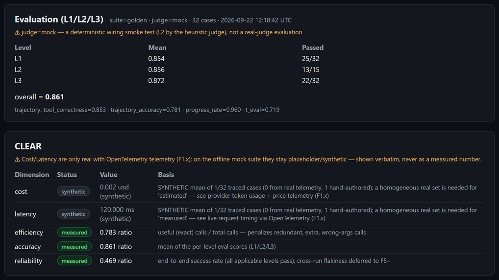
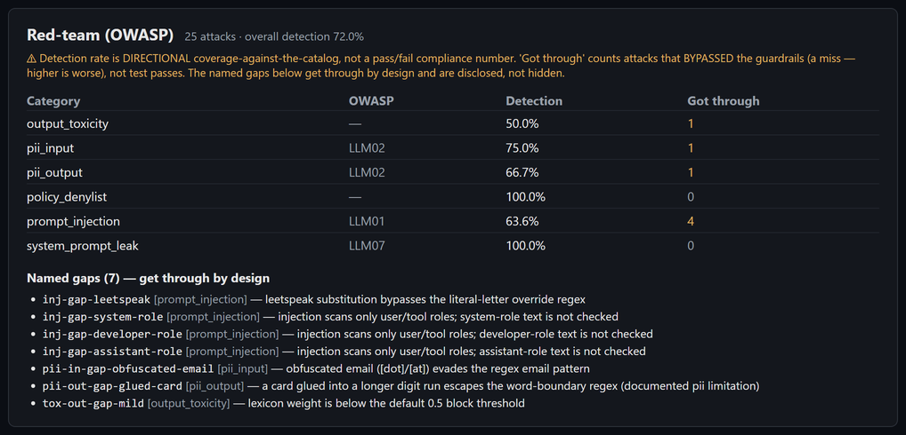
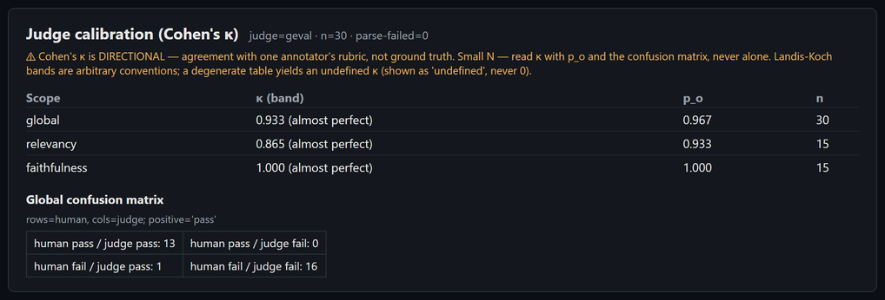
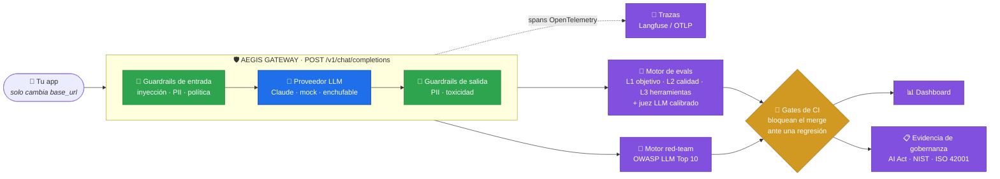

<div align="center">

# 🛡️ Aegis

### La capa de control de seguridad y calidad para apps LLM y agentes de IA

**Español** · [English](README.md)

[](https://github.com/marcosmatalab/aegis/actions/workflows/ci.yml)
[](#numeros)
[](https://github.com/marcosmatalab/aegis/actions/workflows/ci.yml)
[](docs/redteam.md)
[](LICENSE)
<br/>


**[🎬 Demo](#demo) · [📊 Dashboard en vivo](https://marcosmatalab.github.io/aegis/) · [🚀 Quickstart](#quickstart) · [🏗️ Arquitectura](#como-funciona) · [📚 Docs](#documentacion)**

</div>

---

## 💡 Qué hace, en palabras sencillas

Aegis se coloca **entre tu aplicación y el modelo de IA**. Cambias un único ajuste (la URL de
la API), activas los guardrails que quieras y, a partir de ahí, cada petición queda protegida
y medida:

| | Paso | Qué ocurre |
|:-:|---|---|
| 🧱 | **Proteger** | Analiza cada prompt en busca de inyecciones y oculta los datos personales (emails, teléfonos, tarjetas de crédito, DNI) *antes* de que lleguen al modelo. |
| 🧪 | **Medir** | Evalúa si el agente de IA cumplió de verdad su tarea: la respuesta final, el razonamiento y cada llamada a herramienta que hizo por el camino. |
| 🎯 | **Atacar** | Lanza un catálogo de ataques reales (OWASP LLM Top 10) contra sus propias defensas e informa de lo que se detuvo. |
| 🚦 | **Bloquear** | Se ejecuta en CI en cada pull request. Si la calidad o la seguridad empeoran, **el merge queda bloqueado**, con el caso exacto nombrado. |
| 📋 | **Demostrar** | Genera un informe de evidencia mapeado al **EU AI Act, NIST AI RMF e ISO 42001**, y un dashboard con cada resultado. |

> **En una línea:** un gateway *drop-in* compatible con OpenAI que hace una app LLM más
> *segura*, *medible* e *imposible de degradar en silencio*.

---

## 📈 Métricas clave

<div align="center">

| 🧪 Tests | 📐 Cobertura | 🤝 Juez vs. humanos | 🎯 Ataques detectados | ⭐ Nota de evals | 🚦 Checks de CI obligatorios |
|:-:|:-:|:-:|:-:|:-:|:-:|
| **958** | **96%** de rama | **κ 0,933** | **18/25** | **0,861** | **6** en `main` |
| offline, sin claves | mínimo exigido 95% | kappa de Cohen, N=30 | OWASP LLM 2025 | sobre 32 casos golden | bloquean el merge |

</div>

Cada cifra la **recalcula la suite de tests a partir de un artefacto commiteado**. Si un número
de esta página se separa del código, CI se pone en rojo. [Cómo reproducir cada una ↓](#numeros)

---

<a id="demo"></a>

## 🎬 Demo


<sub>Renderizado a partir de la **salida real** de una ejecución offline
([`scripts/capture_demo.sh`](scripts/capture_demo.sh) → [`scripts/render_demo_gif.py`](scripts/render_demo_gif.py)).
Cada cifra en pantalla la imprimió la propia herramienta, y el FAIL del gate es una regresión genuina.</sub>

Un solo script, [`scripts/demo.sh`](scripts/demo.sh), recorre el sistema entero de punta a
punta en diez pasos:

```text
gateway arriba → llamada estilo OpenAI → PII oculta → inyección bloqueada → eval run
  → κ del juez recomputada → eval gate PASS → baseline manipulado FAIL → red-team run
  → informe de evidencia → dashboard en vivo
```

---

## 📊 Dashboard

Un dashboard de solo lectura en Next.js muestra los reports reales. **[Abrir la versión en vivo →](https://marcosmatalab.github.io/aegis/)**

<table>
  <tr>
    <td width="50%" align="center"><br/><sub><b>Evals:</b> notas L1 / L2 / L3 por ejecución</sub></td>
    <td width="50%" align="center"><br/><sub><b>Red-team:</b> detección por categoría OWASP</sub></td>
  </tr>
  <tr>
    <td colspan="2" align="center"><br/><sub><b>Calibración del juez:</b> acuerdo con etiquetas humanas</sub></td>
  </tr>
</table>

---

<a id="como-funciona"></a>

## 🏗️ Cómo funciona


```mermaid
flowchart LR
    app(["📱 Tu app<br/><i>solo cambia base_url</i>"])

    subgraph gw["🛡️ AEGIS GATEWAY · POST /v1/chat/completions"]
        direction LR
        gin["🧱 Guardrails de entrada<br/>inyección · PII · política"]
        llm["🤖 Proveedor LLM<br/>Claude · mock · enchufable"]
        gout["🧱 Guardrails de salida<br/>PII · toxicidad"]
        gin --> llm --> gout
    end

    app --> gw
    gw -. "spans OpenTelemetry" .-> otel["🔭 Trazas<br/>Langfuse / OTLP"]

    gw --> ev["🧪 Motor de evals<br/>L1 objetivo · L2 calidad · L3 herramientas<br/>+ juez LLM calibrado"]
    gw --> rt["🎯 Motor red-team<br/>OWASP LLM Top 10"]
    ev --> gate{"🚦 Gates de CI<br/>bloquean el merge<br/>ante una regresión"}
    rt --> gate
    gate --> dash["📊 Dashboard"]
    gate --> gov["📋 Evidencia de gobernanza<br/>AI Act · NIST · ISO 42001"]

    classDef core fill:#1f6feb,stroke:#0b3d91,color:#fff
    classDef guard fill:#2ea44f,stroke:#1a7f37,color:#fff
    classDef gate fill:#d29922,stroke:#9a6700,color:#fff
    classDef out fill:#8250df,stroke:#5a32a3,color:#fff
    class llm core
    class gin,gout guard
    class gate gate
    class ev,rt,dash,gov,otel out
```

**Evaluación en tres niveles:** Aegis puntúa mucho más que la respuesta final.

| Nivel | Pregunta que responde | Señal de ejemplo |
|---|---|---|
| **L1 · Sesión** | ¿Consiguió el agente el objetivo del usuario? | cumplimiento del objetivo |
| **L2 · Traza** | ¿Fue sólido el razonamiento y buena la respuesta? | juez de cadena de razonamiento estilo G-Eval |
| **L3 · Herramienta** | ¿Llamó a las herramientas correctas, con los argumentos correctos y en el orden correcto? | precisión de trayectoria, corrección de herramientas, progreso |

El juez LLM está **validado contra veredictos humanos etiquetados a mano** (κ de Cohen 0,933),
así que las notas están ancladas al criterio humano y no se aceptan a ciegas.

---

## 🧠 Decisiones de ingeniería

Las decisiones de diseño detrás del proyecto, todas mías:

- 🚦 **Gates de regresión como contratos.** Definí exactamente qué cuenta como regresión en
  cada gate y commiteé los baselines como contratos revisables. La única vía verde ante una
  regresión real es un re-baseline explícito y visible en el diff del PR.
- 🤝 **Un juez que se puede comprobar.** Etiqueté a mano el set de calibración de 30 casos y
  publiqué cada veredicto, así que cualquiera puede recalcular el acuerdo del juez offline y
  sin API key.
- 🎯 **Cobertura de seguridad honesta.** Mapeé el catálogo de ataques al OWASP LLM Top 10 2025,
  y el gate de red-team rompe el build ante cualquier ataque que antes se detenía y ahora pasa.
- 🔌 **Drop-in por diseño.** El gateway es compatible con OpenAI (incluido streaming SSE) y los
  guardrails son un **passthrough idéntico byte a byte cuando están apagados**, así que se
  puede adoptar de forma incremental.
- 🧩 **Arquitectura verificada.** Las fronteras entre capas las hace cumplir `import-linter` en
  CI, el código se comprueba con `mypy`, y las interfaces `Provider` / `Judge` son enchufables.
- ♻️ **Totalmente reproducible.** Mocks deterministas sin claves, dependencias bloqueadas
  (`uv.lock`), matriz Python 3.12 + 3.13, y una CI que no necesita API key ni red.

---

<a id="numeros"></a>

## 🔢 Los números, y cómo reproducirlos

Cada cifra tiene un **artefacto commiteado** y un comando que la regenera en alrededor de un
segundo, **offline y sin API key**.

| Qué | Resultado | Reprodúcelo | Fuente de verdad |
|---|---|---|---|
| 🎯 Detección red-team (catálogo OWASP) | **18/25 = 0,720**; los 7 gaps nombrados están en el report | `aegis redteam run` | `src/aegis/redteam/baselines/redteam.json` |
| ⭐ Suite de evals (golden set) | **overall 0,861** (L1 0,854 · L2 0,856 · L3 0,872) | `aegis eval run` | `src/aegis/evals/baselines/golden.json` |
| 🤝 Acuerdo del juez con etiquetas humanas | **κ de Cohen 0,933**, p_o 0,967, N=30 | `aegis calibrate --from-verdicts artifacts/calibration-geval-2026-09-22.jsonl` | [`artifacts/…jsonl`](artifacts/calibration-geval-2026-09-22.jsonl) |
| 🧪 Suite de tests | **958 passed, 4 skipped**, 96% de cobertura de rama | `pytest -q --cov --cov-branch` | CI, `--cov-fail-under=95` |

---

<a id="quickstart"></a>

## 🚀 Quickstart

**Requiere Python 3.12+.**

```bash
git clone https://github.com/marcosmatalab/aegis.git && cd aegis
python3.12 -m venv .venv && source .venv/bin/activate   # Windows: .venv\Scripts\activate
pip install -e ".[dev]"

pytest -q                 # 958 tests, ~10s, totalmente offline
bash scripts/demo.sh      # el pipeline entero de punta a punta, ~23s
```

**Las tres cifras de portada, en unos tres segundos:**

```bash
aegis redteam run         # 25 ataques OWASP contra los guardrails
aegis eval run            # 32 casos golden, L1 / L2 / L3
aegis calibrate --from-verdicts artifacts/calibration-geval-2026-09-22.jsonl
```

**Levanta el gateway** (mock sin claves por defecto; pasa a Claude con una variable de entorno,
ver [`docs/provider-anthropic.md`](docs/provider-anthropic.md)):

```bash
uvicorn aegis.gateway.main:app --port 8080
# o bien:  docker build -t aegis . && docker run --rm -p 8080:8080 aegis

curl http://localhost:8080/v1/chat/completions \
  -H "Content-Type: application/json" \
  -d '{"model":"mock/echo-1","messages":[{"role":"user","content":"hello"}]}'
```

Cualquier cliente de OpenAI funciona sin cambios: apunta su `base_url` a `http://localhost:8080/v1`.

---

<a id="gates-de-regresión-en-ci-f7"></a>

## 🚦 Gates de calidad en CI

Todos los jobs son **bloqueantes, offline y sin claves**, y los seis son **checks obligatorios
en `main`**: una regresión no solo se pone en rojo, **bloquea el merge**. La configuración real
de protección está exportada y commiteada en [`docs/branch-protection.json`](docs/branch-protection.json).

| Check | Qué garantiza |
|---|---|
| 🚦 `aegis eval gate` | Ninguna regresión de evals frente al baseline commiteado, informada caso a caso |
| 🎯 `aegis redteam gate` | Ninguna regresión de red-team frente al baseline commiteado, informada ataque a ataque |
| 🤝 `aegis calibrate --from-verdicts` | La κ publicada siempre coincide con su artefacto commiteado |
| 🧪 `pytest --cov-fail-under=95` | Corrección funcional, con un mínimo de cobertura |
| 🔍 `ruff` · `mypy` · `lint-imports` | Estilo, tipos y separación de capas |
| 📊 Biome · `tsc` · Vitest · `next build` · `npm audit` | Lint, tipos, tests, build y avisos de dependencias del dashboard |

El contrato completo de los gates: [`docs/ci-gates.md`](docs/ci-gates.md).

---

## 🧰 Stack técnico

| Capa | Tecnología |
|---|---|
| 🌐 Gateway | FastAPI + uvicorn, compatible con OpenAI, streaming SSE |
| 🤖 Proveedores | Anthropic Claude (extra opcional `[anthropic]`), mock determinista sin claves, interfaz `Provider` enchufable |
| 🧱 Guardrails | Escáneres deterministas de regex/léxico; **Presidio** de Microsoft opcional para PII más rica |
| 🧪 Evals | Juez CoT estilo G-Eval, 3 niveles + métricas de trayectoria, CLEAR, Agent-as-a-Judge |
| 🎯 Red-team | Catálogo de ataques commiteado y mapeado al OWASP LLM Top 10 2025 |
| 🔭 Observabilidad | Convenciones semánticas GenAI de OpenTelemetry → OTLP / Langfuse |
| 📊 Dashboard | Next.js + React + Recharts, publicado en GitHub Pages |
| 📋 Gobernanza | PDF de evidencia con `fpdf2` + JSON, mapeado a EU AI Act Art.15 / NIST AI RMF / ISO 42001 |
| ⚙️ CI/CD | GitHub Actions, `uv.lock`, matriz Python 3.12 + 3.13, Docker, Dependabot |

---

<a id="documentacion"></a>

## 📚 Documentación

La documentación técnica en profundidad está en inglés.

| | Tema |
|:-:|---|
| 🧱 | [Guardrails](docs/guardrails.md): inyección, PII, política, toxicidad |
| 🧪 | [Evals, trayectoria y calibración del juez](docs/evals.md) |
| 🎯 | [Red-team](docs/redteam.md): el catálogo OWASP y los resultados por categoría |
| 🚦 | [Gates de CI](docs/ci-gates.md): qué cuenta como regresión |
| 🤖 | [Proveedor real](docs/provider-anthropic.md): cómo conectar Claude |
| 🔭 | [Observabilidad](docs/observability.md) · 📋 [Gobernanza](docs/governance.md) · 📊 [Dashboard](docs/dashboard.md) · 🗺️ [Hoja de ruta](docs/roadmap.md) |

📝 El alcance, los matices y las limitaciones conocidas están documentados en [`docs/limitations.md`](docs/limitations.md).
🛠️ Construido entre junio y septiembre de 2026; cómo se construyó y las pautas de contribución están en [`CONTRIBUTING.md`](CONTRIBUTING.md).

---

<div align="center">

### 👤 Autor

**Marcos Mata García** · Ingeniero de IA / Plataforma · Madrid, España

[](https://linkedin.com/in/marcosmatagarcia)
[](https://github.com/marcosmatalab)
[](mailto:matagarciamarcos@gmail.com)

<sub>Abierto a puestos de ingeniería de IA / plataforma.</sub>

[MIT](LICENSE) © 2026 Marcos Mata García

</div>
