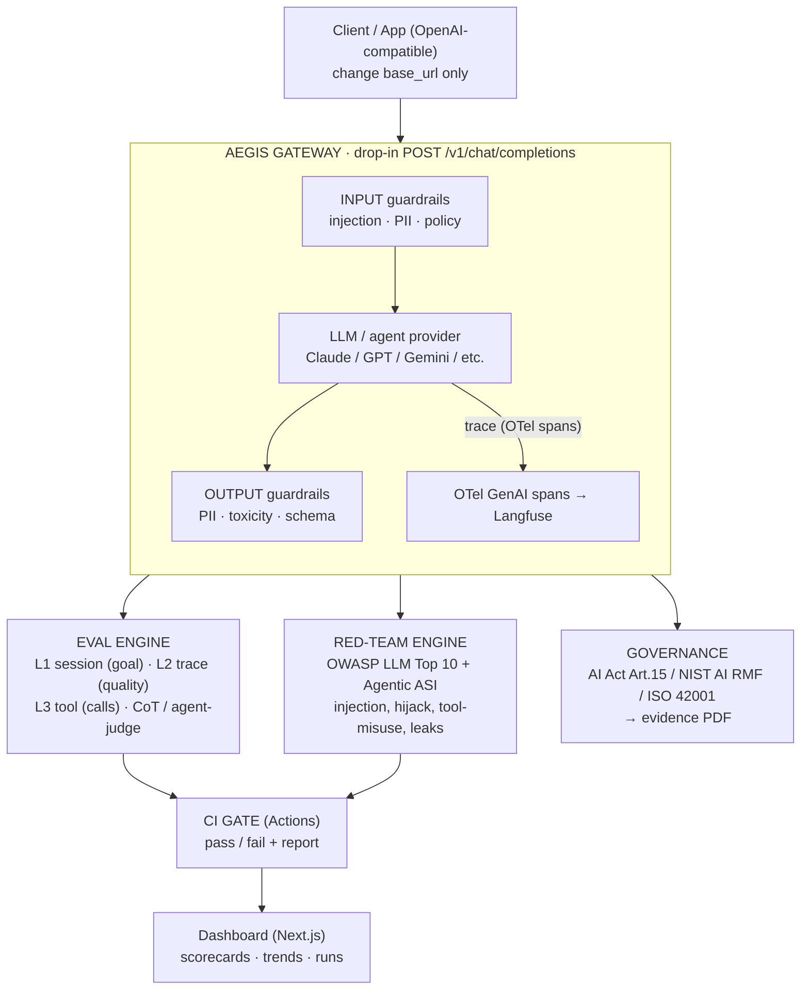

<div align="center">

# 🛡️ Aegis

**The control layer for any LLM or agent** — a drop-in OpenAI-compatible gateway that adds
guardrails, 3-level trajectory evals with a human-calibrated judge, OWASP red-team coverage,
OpenTelemetry tracing, governance evidence, and a CI gate that blocks regressions.

[](https://github.com/marcosmatalab/aegis/actions/workflows/ci.yml)
[](LICENSE)


</div>


## At a glance

- **Offline by default** — 900+ tests, deterministic keyless **mock provider + mock judge**; no API key, no network in CI. Real **Claude** and a real **G-Eval-inspired judge** drop in behind the same ABCs.
- **Guardrails (F2)** — prompt-injection (OWASP LLM01), PII redaction, allow/deny policy, toxicity — **off by default**, a byte-identical passthrough when off.
- **Evals (F3–F5)** — L1/L2/L3 + trajectory metrics + CLEAR; judge agreement with human labels **Cohen's κ ≈ 0.93** (directional).
- **Red-team (F6–F7)** — committed **OWASP-LLM-2025** attack catalog; per-category detection with **named gaps surfaced, not hidden** (coverage-against-catalog, not a security score).
- **Two CI regression gates** — `aegis eval gate` + `aegis redteam gate`, both deterministic and fully offline.
- **Governance (F8)** — evidence mapped to **EU AI Act Art.15 / NIST AI RMF / ISO 42001**, derived from real artifacts — partial technical evidence, not a compliance certificate.

> **Status — pre-alpha, a portfolio project.** F0–F9 are complete and tested offline. The keyless mock provider/judge stay the default so everything runs with no key. Full per-phase detail in the [Roadmap](#roadmap-phased).

## Contents

[Why](#why) · [Architecture](#architecture) · [Demo](#demo) · [Quickstart](#quickstart) · [Roadmap](#roadmap-phased)
**Capabilities:** [Guardrails](#guardrails-f2) · [Real provider](#real-provider--anthropic--claude) · [Evals](#evals-f3) · [Trajectory / CLEAR](#trajectory-metrics-clear--agent-as-a-judge-f4) · [Judge calibration](#judge-calibration-f5) · [Red-team](#automated-red-team-f6) · [CI gate](#ci-regression-gate-f7--evals--red-team) · [Observability](#observability--opentelemetry-tracing-f1x) · [Governance](#governance-evidence-f8) · [Dashboard](#dashboard-f9)
[Tech stack](#tech-stack) · [Honesty guardrails](#honesty-guardrails) · [License](#license)

---

## Why

A single drop-in change (`base_url`) gives an existing app guardrails, request tracing, and continuous evals — without touching its model or business logic. Aegis is not a model; it is the **control layer** around any model or agent.

The differentiator is **evaluation depth**: not just scoring the final output, but scoring the *trajectory* (every tool call, in order, recovering from errors), validating the LLM judge against human labels, and wiring it all into a CI gate so regressions block merges instead of reaching production.

---

## Architecture



**Flow:** `gateway → guardrails → provider → evals / red-team → CI gate`.

---

## Demo

One script — [`scripts/demo.sh`](scripts/demo.sh) — drives the whole system end to end over the keyless deterministic mock and finishes on the live dashboard:

1. **Gateway + `/health`** — the OpenAI-compatible gateway comes up.
2. **Drop-in call** — point any OpenAI client's `base_url` here; `mock/echo-1` answers.
3. **PII redacted** — email/phone become `<EMAIL_ADDRESS>`/`<PHONE_NUMBER>` *before* the provider sees them.
4. **Injection blocked** — an OWASP-LLM01 payload → clean `400 guardrail_blocked` / `prompt_injection`, nothing forwarded.
5. **`aegis eval run`** — L1/L2/L3 + CLEAR over the golden set → `reports/eval-golden.json`.
6. **`aegis calibrate`** — judge-vs-human Cohen's κ → `reports/calibration.json`.
7. **`aegis eval gate`** — PASS vs the committed baseline, then a **tampered baseline copy FAILs** with a named regression.
8. **`aegis redteam run`** — per-OWASP detection rate + the **named gaps** that get through → `reports/redteam-redteam.json`.
9. **`aegis evidence`** — governance pack with **derived** control statuses + the partial-coverage disclaimer → `reports/evidence-golden.json`.
10. **Dashboard** — live over the reports beats 5/6/8/9 just produced, caveats verbatim, missing data shown as absent.

```bash
bash scripts/demo.sh                   # paced for recording (2s between beats)
DEMO_SLEEP=0 bash scripts/demo.sh      # flat-out smoke run (exits 0, no orphan processes)
```

The first run installs the dashboard's deps with `npm ci` (a minute the first time; skipped thereafter). **Nothing is staged:** every number is produced live, the gate FAIL is a real regression against a *throwaway* baseline copy (the committed one is never touched), and the dashboard reads the very reports the run just wrote. Full recording guide (asciinema → GIF) in **[DEMO.md](DEMO.md)**.

---

## Quickstart

> The `/health` probe and the `/v1/chat/completions` proxy run today — on the keyless deterministic mock by default, or against **real Claude** (see [Real provider](#real-provider--anthropic--claude)). Evals run today (`aegis eval run`, `aegis calibrate`), the **CI gate** blocks both eval and red-team regressions (`aegis eval gate`, `aegis redteam gate`), an **automated red-team** scores the guardrails (`aegis redteam run`), and the read-only **dashboard** renders the real reports (`dashboard/`) — see the 2-minute [demo](#demo).

```bash
# 1. Clone and enter
git clone git@github.com:marcosmatalab/aegis.git
cd aegis

# 2. Create a virtualenv and install (dev extras include pytest + ruff)
python -m venv .venv
source .venv/bin/activate          # Windows: .venv\Scripts\activate
pip install -e ".[dev]"

# 3. Configure (optional — defaults to the keyless mock provider)
cp .env.example .env

# 4. Run the gateway
uvicorn aegis.gateway.main:app --reload --port 8080
curl http://localhost:8080/health  # -> {"status":"ok","version":"0.1.0"}

# 5. Call it like the OpenAI API (drop-in: point any client's base_url here)
curl http://localhost:8080/v1/chat/completions \
  -H "Content-Type: application/json" \
  -d '{"model":"mock/echo-1","messages":[{"role":"user","content":"hello"}]}'
# Add "stream": true for an SSE stream of chat.completion.chunk frames.

# 6. Lint + test
ruff check .
ruff format --check .
pytest
```

---

## Roadmap (phased)

| Phase | Deliverable | Status |
|-------|-------------|--------|
| **F0** | Skeleton: packaging, CI, `/health` gateway | ✅ done |
| **F1** | OpenAI-compatible proxy (`/v1/chat/completions`): drop-in `base_url`, SSE streaming, deterministic mock provider, OpenAI error envelope | ✅ done |
| **F1.x** | OpenTelemetry GenAI-semconv tracing of each request (opt-in, no-op default); CLEAR Latency→measured / Cost→estimated from real spans; OTLP/Langfuse optional | ✅ done |
| **F2** | Input/output guardrails: prompt-injection scan (OWASP LLM01), PII redaction (regex default, Presidio optional), allow/deny policy, basic toxicity — off by default | ✅ done |
| **F3** | Evals L1 (session/goal) · L2 (trace/quality, G-Eval CoT) · L3 (tool correctness); golden set + `aegis eval run` + JSON report | ✅ done |
| **F4** | Trajectory metrics (TrajectoryAccuracy, ToolCorrectness, Progress Rate, T-Eval) + CLEAR; Agent-as-a-Judge | ✅ done |
| **F5** | Judge calibration: hand-labelled set + Cohen's κ (per criterion + global) via `aegis calibrate` | ✅ done |
| **F6** | Automated red-team: committed attack catalog vs the F2 guardrails, per-OWASP-category detection rate (`aegis redteam run`) | ✅ done |
| **F7** | CI gate: run **evals and the red-team catalog** per PR and **block merge** on regression vs committed baselines (`aegis eval gate`, `aegis redteam gate`) | ✅ done |
| **F8** | Governance evidence: map real eval/red-team/calibration artifacts + config to EU AI Act Art.15 / NIST MEASURE / ISO 42001 controls → `aegis evidence` PDF (partial technical evidence) | ✅ done |
| **F9** | Read-only dashboard (Next.js + Recharts) over the real reports — scorecards, trends, caveats verbatim (`dashboard/`); 2-minute end-to-end demo (`scripts/demo.sh` → `docs/demo.gif`, [DEMO.md](DEMO.md)) | ✅ done |

---

## Guardrails (F2)

A defense-in-depth layer around the proxy — cheap deterministic checks first, a costlier check only if needed. **Disabled by default** (`AEGIS_GUARDRAILS_ENABLED=false`): with it off, the gateway is a byte-identical F1 passthrough.

- **Input** — prompt-injection detection (deterministic patterns mapped to **OWASP LLM01**, tuned to avoid false positives on legitimate code/prose); **PII redaction** before the request reaches the provider (email, phone, credit card via Luhn, Spanish **DNI/NIE** via the mod-23 checksum); an allow/deny **policy** engine.
- **Output** — **PII-leak** detection (block or redact) and **basic** deterministic **toxicity** detection.
- **Blocking** returns a clean OpenAI error — HTTP 400, `type: "guardrail_blocked"`, with a `code` (`prompt_injection`, `policy_denied`, `pii_leak`, `toxicity`). This works in streaming too: input blocks are a normal JSON 400; output blocks emit a guardrail error frame (no `[DONE]`).
- **PII engine** — the deterministic regex engine is the default (no extra deps, CI-fast). **Microsoft Presidio** is an optional richer engine: `pip install -e ".[guardrails]"` and set `AEGIS_GR_PII_ENGINE=presidio` (also needs a spaCy model).

> **Streaming trade-off:** when output guardrails are active, the stream is buffered and scanned before any byte is sent (leak-safe), so streaming is effectively non-incremental in that mode. With output guardrails off, streaming is fully incremental as in F1.

Each toggle and threshold is configurable via `AEGIS_GR_*` settings (see [.env.example](.env.example)).

---

## Real provider — Anthropic / Claude

The gateway can forward to **real Claude** behind the same `Provider` interface as the mock. The `anthropic` SDK is an **optional extra**, lazy-imported only when selected, so the default install and CI stay keyless and SDK-free.

```bash
pip install -e ".[anthropic]"          # install the optional SDK
export ANTHROPIC_API_KEY=sk-ant-...    # key is read from the env only, never hardcoded/logged
export AEGIS_DEFAULT_PROVIDER=anthropic
uvicorn aegis.gateway.main:app --port 8080
# Now any OpenAI client pointed at this base_url talks to Claude. The leading
# "anthropic/" in a model id is stripped (e.g. "anthropic/claude-opus-4-8").
```

**What the adapter covers (be honest about the edges):**

- ✅ **Text** chat completions, **non-streaming and streaming (SSE)** — OpenAI→Anthropic request translation (system/developer messages hoisted into the top-level `system`, `max_tokens` defaulted since Anthropic requires it, `stop`/`temperature`/`top_p`) and Anthropic→OpenAI response translation (text, `usage`, `stop_reason`→`finish_reason`, model echo).
- ⚠️ **Text only for now.** **Tool-calling** and **non-text multimodal** (images) are **not translated yet** — a request using them is **rejected** with a clean `400 invalid_request_error` (`code: unsupported_by_provider`) rather than silently dropped. **Tool-calling is the tracked next phase**, not an open-ended deferral.
- **Streaming:** `finish_reason` is taken from Anthropic's `message_delta` event (not `message_stop`) so it is never null. A usage chunk is emitted only when the request sets `stream_options.include_usage` (OpenAI's contract). A failure mid-stream surfaces as an SSE error frame (the HTTP 200 is already committed), carrying the mapped `type`/`code`; no `[DONE]` follows.

**Documented divergences from OpenAI:**

- `temperature` is **clamped to [0, 1]** (Anthropic's max is 1; OpenAI allows 2) — a value like `1.5` is accepted and capped rather than erroring — **and omitted entirely (along with `top_p`/`top_k`) for models that reject sampling params: Opus 4.7+, all Opus 5.x, and unknown newer Opus (which default to omit, conservatively)**. Those models return `400 temperature is deprecated for this model` otherwise; per Anthropic guidance you drop the field and let the model's default sampling apply (reasoning control on 4.8 is `effort` + adaptive thinking, not temperature). Sonnet/Haiku, Opus 4.6-and-earlier, and the legacy `claude-3-opus-*` keep the clamp.
- `created` is a synthesized wall-clock timestamp (Anthropic does not return one), so the real-provider path is **not** byte-deterministic like the mock.
- An unrecognized `stop_reason` falls back to `finish_reason: "stop"`.

**Error mapping** (upstream failure → OpenAI envelope; messages are generic so no key/internals leak):

| Anthropic | HTTP | `type` | `code` |
|---|---|---|---|
| 401 | 401 | `authentication_error` | `upstream_authentication` |
| 403 | 403 | `permission_error` | `upstream_permission_denied` |
| 404 | 404 | `not_found_error` | `upstream_model_not_found` |
| 429 (+`Retry-After`) | 429 | `rate_limit_error` | `rate_limit_exceeded` |
| 400 | 400 | `invalid_request_error` | `upstream_invalid_request` |
| any other (e.g. 413) / 5xx | **502** | `api_error` | `upstream_error` |
| timeout | **504** | `api_error` | `upstream_timeout` |
| connection | **502** | `api_error` | `upstream_unavailable` |

Selecting `anthropic` with **no key** or **without the SDK installed** is a clean `provider_not_configured` (HTTP 500) — never an `ImportError`. The whole adapter is unit-tested offline with a fake client (no key, no SDK, no network); one **skippable live test** runs only when `ANTHROPIC_API_KEY` is set and the SDK is installed.

**Client lifecycle.** The real provider owns a network client (an httpx connection pool), so it is built **once per process** — cached on `app.state` and reused across requests behind an `asyncio` lock (so concurrent first-requests can't race two clients into existence) — and **closed cleanly on shutdown** via the FastAPI lifespan. Construction stays lazy (on the first request, never at startup), so an `anthropic`-with-no-key boot is still a 500 *response* rather than a startup crash. The keyless mock holds no resources and is unaffected.

---

## Evals (F3)

A 3-level eval engine that runs fully **offline** over a hand-made golden anchor set:

- **L1 — session / goal** (deterministic, no LLM): the goal is met iff every required tool was called, every `must_include` keyword is present (as a whole word), and no `must_not_include` keyword appears.
- **L2 — trace / quality** (LLM-as-judge): relevancy (vs a reference) and faithfulness (vs context), scored by a **G-Eval-inspired** judge that reasons briefly before scoring. The judge is abstracted behind an interface with a deterministic **MockJudge** (default), so the suite runs with no API keys; a **real** judge that reuses the Anthropic provider (the single cached client) and an ensemble are wired behind it (`AEGIS_JUDGE_BACKEND=geval|ensemble`).
- **L3 — tool** (deterministic, no LLM): tool-call correctness (right tool, right args, right order) via an F1 over exact matches plus an LCS order score.

Run it:

```bash
aegis eval run                       # scores the golden set with the mock judge
aegis eval run --suite ci --output reports/ci.json
# --fail-under is a manual absolute-floor seam; the real baseline-comparing
# gate is `aegis eval gate` (F7) — see "CI regression gate (F7)" below.
```

> **Honesty (this matters):** the LLM-as-judge is treated as **directional** — a signal validated against human labels (Cohen's κ — now implemented, see [Judge calibration (F5)](#judge-calibration-f5)), **not ground truth**. The MockJudge is **purely lexical**: relevancy is token overlap and L2 **faithfulness is lexical containment, not entailment** — a reordered copy of the context scores 1.0 (see the golden case `reordered-copy-limitation`), and every deterministic L2 "pass" is therefore a lexical match (verbatim / permuted / subset), never a rewarded paraphrase. L3's order check is over tool *names*, so duplicate same-tool calls are order-insensitive (documented in the scorer). What the project actually sells is that the **eval gate catches regressions**, not that any single judge is correct. The golden set interleaves passing and failing cases — including several where one level passes while another fails — to demonstrate L1/L2/L3 are independent.

> **The real judge is G-Eval-*inspired*, not canonical.** It uses light Chain-of-Thought (justify, then score) but reads the score **directly** from a compact JSON reply — it does **not** do canonical G-Eval's logprob-weighted scoring, because the Anthropic API exposes no per-token logprobs. The honest consequence is **more variance** than logprob G-Eval, which is why it runs at **temperature 0** and why **judge calibration (Cohen's κ vs human labels) is now implemented** ([F5](#judge-calibration-f5)) — the score is still directional, not ground truth. A messy or truncated reply **never crashes the eval**: it falls back to a **neutral 0.5 flagged `parse_failed`**, surfaced in the L2 breakdown of the persisted report so a degradation is auditable (note: a neutral 0.5 *passes* the diagnostic L2 threshold, so the flag — not the score — is what tells you the judge didn't really measure). The real judge is exercised by injected fakes offline plus **one gated, skippable live test** (a single low-`max_tokens` call); the bulk suite stays on the keyless MockJudge.

---

## Trajectory metrics, CLEAR & Agent-as-a-Judge (F4)

F4 adds richer, mostly-deterministic **trajectory** scoring on top of L3, a per-run **CLEAR** scorecard, and an **Agent-as-a-Judge** that evaluates the *process* — all offline, surfaced in the same `aegis eval run` report.

**Trajectory metrics** (each 0..1, computed over the golden trajectory; they share L3's matcher):

| Metric | What it measures | Distinct from |
|--------|------------------|---------------|
| **ToolCorrectness** | F1 over exact (name+args) matches, order-insensitive | the order-sensitive metrics below |
| **TrajectoryAccuracy** | similarity of the whole path to the golden path — LCS over full steps, normalized by the longer sequence (tolerant of insertions) | T-Eval (which is strict positional) |
| **Progress Rate** | AgentBoard-style fraction of **milestones** (subgoals) reached, **order-independent**; milestones are explicit or derived from the expected tools | survives reordering, unlike Trajectory/T-Eval |
| **T-Eval** | step-by-step planning: is the call at each **position** the expected one? strict positional match, so one early insertion penalizes every later step | TrajectoryAccuracy (which realigns via subsequence) |

**CLEAR** (five dimensions per run) — and an explicit table of each dimension's `status`, which is honest about *how* the number was obtained:

| Dimension | Status | How it's computed |
|-----------|--------|-------------------|
| **Accuracy** | ✅ measured | mean of the per-level eval scores (the suite `overall`) |
| **Efficiency** | ✅ measured | useful (exact) tool calls / total calls — penalizes redundant, extra, wrong-args calls |
| **Reliability** | ✅ measured (proxy) | end-to-end success rate (all applicable levels pass); cross-run flakiness deferred to F5+ |
| **Latency** | 📈 **measured** *with real telemetry* | the request span's wall-clock duration (F1.x); **synthetic** from hand-authored `trace.latency_ms`, **placeholder** with no trace |
| **Cost** | 🧮 **estimated** *with real telemetry* | real measured tokens × a **static list price** (`evals/pricing.py`) — an estimate, not a measurement; **synthetic** from hand-authored `trace.cost_usd`, **placeholder** with no trace / unpriced model |

The four statuses — `measured`, `estimated`, `synthetic`, `placeholder` — ride in the JSON report and the CLI summary (only `measured` renders without a suffix), so a list-price estimate is never mistaken for a real measurement and a hand-authored number is never mistaken for either. **`measured`/`estimated` are reached ONLY when real telemetry flows through the F1.x bridge** (see [Observability](#observability--opentelemetry-tracing-f1x)); the committed mock suite has no real telemetry, so `aegis eval run` over the golden set stays `placeholder`/`synthetic`. The basis string discloses the traced denominator (e.g. `1/32 traced cases`), and a mixed-provenance suite honestly **downgrades to `synthetic`** rather than letting one real case launder the rest. Cost/Latency only get a normalized 0..1 score when an optional budget/SLO (`AEGIS_CLEAR_COST_BUDGET_USD` / `AEGIS_CLEAR_LATENCY_BUDGET_MS`) is set.

**Agent-as-a-Judge** evaluates the trajectory itself — **loops**, **redundant steps**, and **error recovery** (via each call's `status`). It reuses F3's judge *pattern* (an async ABC + a deterministic mock + a clearly-stubbed real backend) but not F3's output-centric `Judge` interface.

> **Honesty (same line as F3):** the `MockTrajectoryJudge` is an **illustrative heuristic, not a semantic judge** — it flags loops/redundancy by **literal pattern matching** over the recorded calls and infers recovery from the `status` field, with **fixed, arbitrary penalty weights** (so tests can assert exact numbers). It does not understand whether a step was *reasonable*. The real reasoning-LLM `agent` backend is a clear stub here. As with the F3 judge, the value is a **regression-catching signal**, not ground truth.

---

## Judge calibration (F5)

How much does the real (G-Eval-inspired) judge agree with a human? `aegis calibrate` scores the configured judge over a **hand-labelled set of 30 cases** (15 relevancy + 15 faithfulness, `src/aegis/evals/datasets/calibration.jsonl`) and reports **Cohen's κ** — observed agreement corrected for chance — **per criterion and global**, alongside the raw agreement `p_o` and the full confusion matrix, into a gitignored `reports/` JSON.

**Result** — one run, judge frozen (`claude-opus-4-8`, temperature dropped per the Opus 4.7+ rule, `max_tokens=1024`), 0 parse failures over all 30 cases:

| Scope | Cohen's κ | p_o | n | confusion (HpJp / HpJf / HfJp / HfJf) |
|---|---|---|---|---|
| Global | ≈0.93 | 0.97 | 30 | 13 / 0 / 1 / 16 |
| Relevancy | ≈0.86 | 0.93 | 15 | 6 / 0 / 1 / 8 |
| Faithfulness | 1.00 | 1.00 | 15 | 7 / 0 / 0 / 8 |

Rows = human, cols = judge, positive class = `pass` (HpJp = human-pass/judge-pass, etc.).

How to read this honestly — it is **not** "the judge is 93% correct":
- **Directional, wide CI.** N=30, single annotator: one flipped label moves κ by ~0.06–0.13, so this is a directional signal, not a precise constant.
- **Optimistic upper bound.** The calibration set was authored and labelled within the same model family as the judge, on mostly unambiguous cases. Agreement on clear cases is cheap; on independent, messy production traffic it would likely be lower. This is a ceiling, not a field estimate.
- **The single disagreement is the finding.** Exactly one case diverges (global `HfJp = 1`, in relevancy): the judge *passed* a case the human failed. There are **zero** false-fails (`HpJf = 0` in every scope), so the judge's only observed error mode here is **over-approval** — it skews permissive, not strict. (Per-case verdicts are not yet persisted, so the specific case is not recoverable from this run; persisting them is tracked for the CI gate.)

As everywhere else: the judge is a **directional** signal validated against human labels, not ground truth — what the gate ultimately enforces is regression-catching, not judge correctness.

```bash
aegis calibrate --judge geval       # real run: needs ANTHROPIC_API_KEY + the [anthropic] extra
aegis calibrate --judge mock        # offline wiring smoke test only (see below)
```

κ binarizes the judge's continuous score at the **operative 0.5 threshold** (`>= 0.5` → pass) and compares it to the human pass/fail label, over the 2×2 table `κ = (p_o − p_e) / (1 − p_e)`.

**Read the number honestly — this is calibrated to be modest, not impressive:**

- **κ is DIRECTIONAL, not a quality verdict.** It measures *agreement with one annotator applying the rubric*, never ground truth — the value proposition stays "the gate catches regressions".
- **On Opus 4.7+ the judge can no longer pin `temperature=0`.** Those models reject sampling params, so the adapter omits `temperature` and the judge relies on the model's *default* sampling — i.e. **more** run-to-run variance, not less. One more reason κ matters: we measure agreement under the sampling the model actually uses, not under an idealized pinned-zero temperature.
- **N = 30 → a wide confidence interval.** The point estimate is indicative, not precise. The CI is *stated*, not computed (bootstrapping 30 points would over-promise).
- **A single person labelled the set.** This is one-rater agreement, not consensus gold; there is no second annotator or adjudication.
- **The κ paradox / base-rate sensitivity:** with skewed marginals (global 13 pass / 17 fail) a high `p_o` can still yield a low or even undefined κ. So the report **always shows `p_o` and the confusion matrix beside κ** — never κ alone. When both raters collapse to one class (`1 − p_e = 0`) κ is mathematically undefined and is reported as `null` / band `undefined`, keeping the real `p_o`, rather than a fabricated 0.0 or 1.0.
- **`parse_failed` verdicts are EXCLUDED from κ and counted separately.** A parse failure is not a judgment, and its neutral 0.5 would otherwise count as a pass at the boundary; it is dropped before binarizing and surfaced as a count per scope.
- **Landis-Koch bands** (slight / fair / moderate / substantial / …) are reported for orientation, but the **band boundaries are arbitrary conventions**, not objective thresholds.
- **`human_label` (categorical) drives κ;** `human_score` (0/1) is a redundant numeric mirror kept only to cross-check the label at load time, never averaged in.
- **`--judge mock` is a wiring smoke test, not a calibration** — it measures the lexical mock against the labels, not the judge being calibrated. The CLI says so on stderr and the report records `judge: "mock"` plainly.

---

## Automated red-team (F6)

`aegis redteam run` runs a committed, versioned catalog of synthetic attacks (`src/aegis/redteam/datasets/attacks.jsonl`) **directly against the F2 guardrail pipeline** — fully offline, deterministic, keyless, no model and no network. It reuses `GuardrailPipeline.check_input` / `check_output` exactly as the proxy does, classifies each attack's `GuardrailResult` as **blocked** / **redacted** / **passed**, and reports a per-category **detection rate**.

**Result** — one run over 25 attacks (every row's expectation is pinned to real pipeline behaviour by a self-consistency test):

| Bucket | OWASP 2025 | detection | passed |
|---|---|---|---|
| `prompt_injection` | LLM01 | 7/11 (0.636) | 4 |
| `system_prompt_leak` | LLM07 | 3/3 (1.000) | 0 |
| `pii_input` | LLM02 | 3/4 (0.750) | 1 |
| `pii_output` | LLM02 | 2/3 (0.667) | 1 |
| `output_toxicity` | *content-safety — no clean OWASP slot* | 1/2 (0.500) | 1 |
| `policy_denylist` | *config-driven policy — not OWASP* | 2/2 (1.000) | 0 |
| **overall** | | **18/25 (0.720)** | **7** |

How to read this honestly — it is **coverage-against-this-catalog, NOT total security**:
- **Only the categories the F2 guardrails genuinely exercise are mapped.** `prompt_injection`→**LLM01**; `system_prompt_leak`→**LLM07** (the *same* injection detector and the *same* `prompt_injection` code as LLM01 — disclosed, not two detectors); PII in/out→**LLM02** (split by vector). Output toxicity is a tiny lexicon with **no clean OWASP-2025 slot**, and the policy bucket is a **config-driven content deny-list** (an illustrative bundled fixture, *not* a production policy and *not* OWASP LLM06 Excessive Agency). The OWASP edition is **2025**.
- **A passing attack is a surfaced finding, not a hidden failure.** The catalog deliberately ships payloads the regex/lexicon scanners are KNOWN to miss — leetspeak override, injection in the non-scanned `system`/`assistant`/`developer` roles, an obfuscated email, a glued-digit credit card, sub-threshold toxicity — so the detection rate is a real number below 100% with **every gap named** in the report's `known_gaps`. A `passed` row that is not a flagged gap fails to load.
- **Not covered (and why):** **ASI02 tool-misuse / ASI03 identity** — Aegis is a stateless text proxy that runs no agent loop and executes no tools; the guardrails inspect only flattened text, and tool/multimodal parts (forwarded at intake under `extra="allow"`) are rejected by the real Anthropic adapter (`ensure_text_only`, 400) — so there is no tool execution or agent trajectory to attack; **LLM05** (Improper Output Handling = downstream XSS/SQLi/code-exec) — no downstream renderer/executor; **LLM03/04/08/09/10** — no training/supply-chain, agency, or quota surface here; non-English coverage beyond the shipped Spanish variants is a known gap. ASI01 goal-hijack is disclosed only as an *overlap* on injection rows.
- **It REPORTS; it does not gate.** The runner returns typed findings in the *same shape* as the eval gate's regressions (`kind` / `scope` / `detail`), so a future `aegis gate` can union them additively — but F6 builds **no** red-team gate, no baseline, and exits 0 by default (an opt-in `--fail-under-detection` floor is off unless passed). Red-team *gating* is a later phase; this is why F7 stays partial.

---

## CI regression gate (F7 — evals + red-team)

`aegis eval gate` runs the eval suite on the **deterministic, offline MockJudge/MockProvider** and compares the result to a **committed baseline** (`src/aegis/evals/baselines/golden.json` — versioned, *not* gitignored; it is the gate contract). On a regression it exits non-zero, so a required CI check blocks the PR. The CI job is `eval-gate` in [`.github/workflows/ci.yml`](.github/workflows/ci.yml): no key, no SDK, no network.

```bash
aegis eval gate                    # CI runs this: mock vs committed baseline; exit 1 on regression
aegis eval gate --update-baseline  # regenerate the contract after an intended change, then commit it
```

A **regression** is any of: a per-level mean drop beyond `--tolerance` (default 0.005); a **per-case score drop** on any applicable level (exact after 6-dp rounding — this catches sub-threshold L2 erosion that does *not* flip pass/fail); a per-case **pass→fail** flip; an L2 case dropping out of the judged set; or a **new `parse_failed`**. Each is printed naming the exact case/level. A stale or mismatched baseline (case-set changed, judge ≠ `mock`) exits **2** ("regenerate"), distinct from a real regression (**1**). Improvements never fail the gate.

**What it guarantees — and what it does not:**

- **It catches regressions; it does NOT validate the real judge.** The gate runs the **mock**, so it guards the eval **pipeline** (scoring, aggregation, dataset, wiring) against the baseline. Whether the *real* judge is any good is a **separate** question answered by [Judge calibration (F5)](#judge-calibration-f5) (Cohen's κ), which is directional, not ground truth.
- **The guarantee is "no SILENT regression", not "no regression ever".** `--update-baseline` *can* re-baseline worse scores and make the gate green — but the baseline is committed, so re-baselining a regression is a **visible diff in the PR**: a named, blocking, reviewable event. The gate turns a regression into noise that a human reviewer sees; **review is the final backstop**, not the gate alone.
- **A self-consistency test locks the baseline to the code.** A pytest asserts the committed baseline exactly equals a fresh mock run, so a scoring or golden-set change that forgets `--update-baseline` fails locally *before* CI — the committed floor can never silently lag reality.
- **`parse_failed` is a latent, forward-looking tripwire.** The mock never parse-fails, so it cannot fire under today's offline gate; it exists for a future real-judge baseline and is exercised only via the pure comparator's unit tests.
### Red-team gate

`aegis redteam gate` scores the committed attack catalog against the F2 guardrails on the **same hermetic, offline pipeline** as `aegis redteam run` (`build_redteam_settings` pins every field — no key, no SDK, no network) and compares to a committed baseline (`src/aegis/redteam/baselines/redteam.json` — versioned, *not* gitignored). The CI job is `redteam-gate`.

```bash
aegis redteam gate                    # CI runs this: catalog vs committed baseline; exit 1 on regression
aegis redteam gate --update-baseline  # regenerate the contract after an intended change, then commit it
```

- **What's a regression.** An attack the baseline recorded as **caught** (blocked/redacted) that now **passes** (`attack_now_passing`); a **block downgraded to a mere redaction** (`detection_downgraded`); or a per-category detection-rate drop beyond `--tolerance`. A stale/remapped/mismatched baseline (attack-set changed, category remapped, mode ≠ `mock-offline`) exits **2**. A blocked attack whose guardrail **code** changes while still blocked is an **informational note, not a failure** (the codes have no strength ordering, and the short-circuit pipeline can legitimately change which stage fires). **Improvements never fail** — a gap that gets caught, or a redaction promoted to a block, is welcome; you re-baseline to lock it in.
- **You cannot hide a red-team regression by calling it a "known gap".** The baseline records each attack's *prior observed* outcome **independent of the catalog's `expected_outcome`/`is_known_gap`**, so weakening a guardrail and relabeling the now-passing attack a gap **in the same PR still fails** `attack_now_passing` — a catalog edit cannot override the frozen baseline. The detection rate is **coverage-against-catalog (it includes the named gaps), never "security coverage."**
- **Same guarantee as the eval gate: "no SILENT regression", not "no regression".** The only green path past a real weakening is `--update-baseline`, which writes a visible `blocked/redacted → passed` diff into the committed baseline — the single highest-signal line in a red-team PR — that a human must approve. A self-consistency test locks the committed baseline to a fresh hermetic run, so a guardrail/catalog change that forgets `--update-baseline` fails locally before CI. **Review is the final backstop.**

**Enabling the block (one-time, maintainer action in GitHub):** Settings → Branches → branch-protection rule for `main` → *Require status checks to pass before merging* → require the **`eval-gate`** and **`redteam-gate`** checks (alongside `lint-and-test`). The check names must match the job ids **exactly** or GitHub silently never blocks. Until both are required, the jobs run and report but do not hard-block; the repo cannot self-apply branch protection, and a re-baseline PR (`--update-baseline`) needs explicit human sign-off.

---

## Observability — OpenTelemetry tracing (F1.x)

The gateway emits **one OpenTelemetry span per `/v1/chat/completions` request**, following the **GenAI semantic conventions (~v1.38)**. Attributes are `gen_ai.operation.name` (`chat`), `gen_ai.request.model`, `gen_ai.response.model`, `gen_ai.provider.name` (the attribute that superseded `gen_ai.system`), and `gen_ai.usage.input_tokens` / `output_tokens`; the span name is `chat {model}` and its wall-clock duration is the gateway's first real request timing.

> **Young convention, pinned + disclosed.** The GenAI semconv moved to its own repo, [`open-telemetry/semantic-conventions-genai`](https://github.com/open-telemetry/semantic-conventions-genai), and is **still evolving** — client spans left *experimental* in early 2026 but parts of the spans spec remain "Development" and `OTEL_SEMCONV_STABILITY_OPT_IN` exists. Aegis pins the attribute keys as its own string constants (so a package bump can't break it) and discloses the version in the module docstring.

- **Opt-in, no-op by default.** `AEGIS_OTEL_ENABLED=false` (default) installs no `TracerProvider` and the proxy is a **byte-identical F1/F2 passthrough** — no span, no timing, no SDK import (the `[otel]` extra need not even be installed). This mirrors the `guardrails_enabled` posture. A monkeypatched-absent test proves the no-op branch even though CI installs OTel.
- **Exporter needs no collector.** `AEGIS_OTEL_EXPORTER=none` (default when enabled) creates + attributes spans but exports nowhere — tests assert on them via an in-memory exporter, so **CI is green offline**. `console` writes to stderr for local debugging; `otlp` (→ an OTLP collector or **Langfuse**) is lazy-imported behind the `[otel]` extra and reads `OTEL_EXPORTER_OTLP_ENDPOINT`, using a `BatchSpanProcessor` so a stalled collector never adds latency to a request.
- **Privacy default (ties into F2).** Spans carry **metadata only** — model, token counts, duration. **No message content** (`gen_ai.input.messages` / `output.messages`; `gen_ai.prompt` / `completion` are deprecated) is ever captured, because dumping prompt/response text into telemetry would re-leak the very PII the F2 guardrails strip. Content capture is not implemented; any future capture would be an explicit, documented, off-by-default opt-in.

**This is what turns CLEAR honest about Cost/Latency.** A real request span is bridged into a `CaseTrace` (`evals/telemetry_bridge`): the span's duration is a **measured** Latency, and real tokens × a **static list price** (`evals/pricing.py`) is an **estimated** Cost (an estimate, not a measurement — hence the distinct status). The mock and any unpriced model have no price-table entry, so they can **never** produce a cost; and `measured`/`estimated` provenance is set only by this runtime bridge — the golden loader **rejects** a hand-authored file that claims it. Anthropic's v1.38 cache-token attributes are a noted future enhancement, not yet implemented.

```bash
# Trace to stderr locally (mock provider, no collector needed):
AEGIS_OTEL_ENABLED=true AEGIS_OTEL_EXPORTER=console \
  uvicorn aegis.gateway.main:app --port 8080
# Export to an OTLP collector / Langfuse (needs the [otel] extra + an endpoint):
pip install -e ".[otel]"
AEGIS_OTEL_ENABLED=true AEGIS_OTEL_EXPORTER=otlp \
  OTEL_EXPORTER_OTLP_ENDPOINT=http://localhost:4318 \
  uvicorn aegis.gateway.main:app --port 8080
```

---

## Governance evidence (F8)

`aegis evidence` generates a **partial technical evidence** document mapping the real artifacts Aegis already produces to specific framework controls. It is **not a compliance certificate** — it is auto-generated from system data, it maps only the small set of technical controls below, and the majority of each framework's **underlying clauses** are explicitly out of scope (so the control counts are not a coverage percentage).

> **The crux:** every control's status is **derived from a real artifact field at generation time**, never hand-written. No artifact → the control is `not_covered` (with the exact command to produce it), never "compliant" with invented text. `measured`/`estimated` is earned only from real telemetry; the golden loader refuses a hand-authored report that claims it.

**Four statuses** per control: `covered` (a first-class real measurement backs it) · `partial` (real value, but the control's full intent exceeds it — carries a caveat) · `not_covered` (the artifact is absent / the live posture is off) · `out_of_scope` (Aegis structurally can't evidence it — the majority).

**What backs what (real sources):**

| Evidence | Real source | Controls (with verified ids) |
|---|---|---|
| Accuracy / V&V | `eval-<suite>.json` (CLEAR + L1/L2/L3) | Art.15(1)/(3), NIST **MEASURE 2.3**, ISO **A.6.2.4** |
| Reliability | same (`clear.reliability`) | NIST **MEASURE 2.5** |
| Robustness / adversarial | `redteam-<suite>.json` (detection rate + **named gaps**) | Art.15(4), NIST **MEASURE 2.7** |
| Safety (output toxicity / PII only, **partial**) | `redteam-<suite>.json` (toxicity + PII-leak categories) | NIST **MEASURE 2.6** |
| Measurement validity | `calibration.json` (Cohen's κ) | NIST **MEASURE 2.13** |
| Input/output posture | **effective config** (guardrail flags) | Art.15(5), ISO **A.6.2.6** |
| Request event logs | effective config (`AEGIS_OTEL_ENABLED`) | ISO **A.6.2.8** |

**Honesty gates** (enforced in the pure builder, tested): a `mock` judge caps eval controls at `partial` (it's a wiring smoke test); an undefined Cohen's κ is `not_covered`, never a stale "almost perfect"; guardrails-off renders the posture control `not_covered` (the real OFF state, reported honestly); the guardrail posture (config *now*) and the red-team report are **separate** controls, since the posture is not necessarily the config the red-team report ran under. **Out of scope** (stated up front): EU AI Act Arts. 9/10/12/13/14; NIST GOVERN/MAP/MANAGE; ISO 42001 management-system controls (A.2–A.5, A.7–A.10).

```bash
pip install -e ".[reporting]"                 # fpdf2 (pure-Python, offline, no system libs)
aegis evidence --eval reports/eval-golden.json --output reports/evidence.pdf
aegis evidence --format json --output reports/evidence.json   # JSON sidecar; needs no fpdf2
```

> Framework provenance: NIST MEASURE **ids** are verbatim from NIST AI 100-1 (titles abbreviated/paraphrased); EU AI Act Art.15 paragraph numbering via the official-text aggregators; ISO/IEC 42001 Annex A ids/titles are paraphrased from public listings (the standard is paywalled) — each control row records its `verified_via` source. Anthropic's v1.38 cache-token span attributes are a noted future enhancement, not yet implemented.

---

## Dashboard (F9)

A **read-only** Next.js + Recharts dashboard (in [`dashboard/`](dashboard/)) that visualizes the **real reports** Aegis already writes — `eval-*.json`, `redteam-*.json`, `calibration.json`, and the F8 `evidence-*.json`. It is part 1 of F9; the 2-minute end-to-end [demo](#demo) is part 2 — both shipped.

> **Same crux as F8 — never rosier than the reports.** Every panel is derived from a report file read at request time (server-side, read-only); a missing report renders as an explicit **"Not available"** with the command to produce it, never a zero/blank/faked chart. Statuses are shown **verbatim** — CLEAR (`measured`/`estimated`/`synthetic`/`placeholder`) and evidence (`covered`/`partial`/`not_covered`/`out_of_scope`) — and only `measured`/`covered` get a success colour (enforced by a tested `statusTone`). Red-team **named gaps**, the κ caveats (small N, directional, undefined-when-degenerate), and the evidence partial-coverage note are surfaced, not buried. A trend line is drawn only for **≥2** real eval runs (else an honest absent note; no interpolation).

- **Offline.** No provider/model call, no network, no telemetry, system fonts only — it only **reads** the reports directory (`AEGIS_REPORTS_DIR`, default `../reports`).
- **Tested.** A pure, null-safe parsing layer (`dashboard/lib/parse/`) turns each report into a typed view-model (status preserved, absent first-class) — unit-tested with Vitest; a CI `dashboard` job runs Biome + `tsc` + Vitest + `next build` fully offline.

```bash
cd dashboard && npm ci && npm run dev   # http://localhost:3000 — reads ../reports
```

> `dashboard/fixtures/` is **SAMPLE data for unit tests only — NOT real Aegis results**; the dashboard at runtime always reads the real `reports/` directory.

---

## Tech stack

| Layer | Technology |
|-------|------------|
| API gateway | FastAPI + uvicorn (OpenAI-compatible endpoint) |
| Real provider | Anthropic SDK (lazy, optional `[anthropic]` extra); the `Provider` ABC is multi-provider-ready — OpenAI/Gemini are interface seams, not yet implemented |
| Guardrails | deterministic regex/lexicon scanners (default, keyless); Microsoft **Presidio** optional for richer PII (`[guardrails]`) |
| Evals & judge | G-Eval-inspired CoT judge (Anthropic), 3-level + trajectory metrics, Agent-as-a-Judge (stub backend) |
| Red-team | committed synthetic-attack catalog mapped to OWASP LLM 2025 (`redteam run` + `redteam gate`) |
| Observability | OpenTelemetry GenAI semconv (~v1.38); OTLP → Langfuse optional (`[otel]`) |
| Persistence | JSON reports on disk (`reports/`, gitignored) — no database |
| Dashboard | Next.js + React + Recharts (read-only, server-read) |
| Governance | `fpdf2` evidence PDF + JSON sidecar (optional `[reporting]`) |
| CI | GitHub Actions — `eval-gate` + `redteam-gate` regression gates, fully offline |

---

## Honesty guardrails

This is a **portfolio project**, not a product with customers. Reported numbers are real measurements over the project's own golden set — no inflated claims. The LLM judge is treated as *directional* and **validated against human labels with Cohen's κ** ([Judge calibration (F5)](#judge-calibration-f5)) — reported with `p_o` + the confusion matrix, on N=30 from a single annotator, so κ is read as a wide-CI directional signal, not a precise verdict; the value proposition is that the **gate catches regressions**, not that any single judge is ground truth. Guardrails are defense-in-depth with coverage mapped to OWASP — not a claim of total detection.

---

## License

[MIT](LICENSE) © 2026 Marcos Mata García
