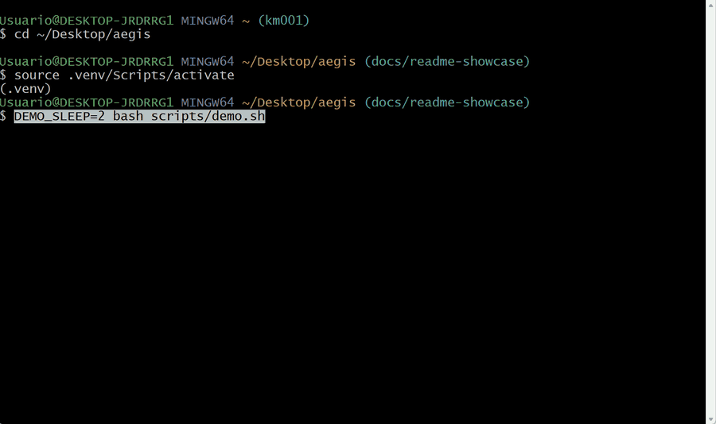
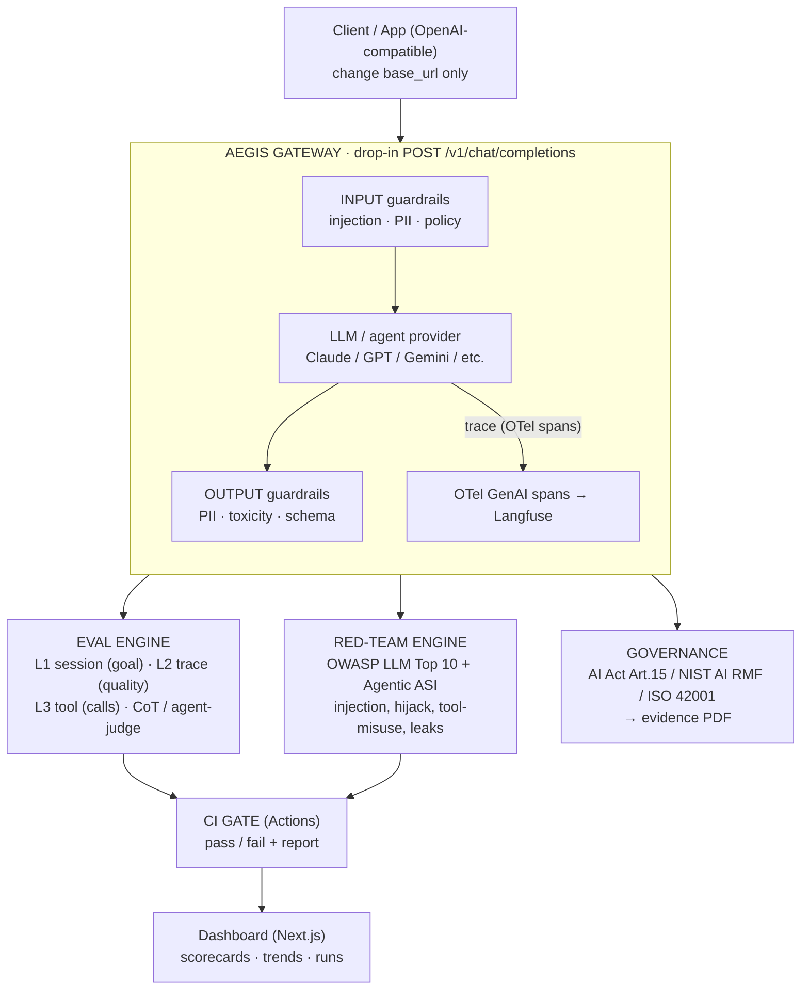

<div align="center">

# 🛡️ Aegis

**English** · [Español](README.es.md)

**The control layer for any LLM or agent** — a drop-in OpenAI-compatible gateway that adds
guardrails, 3-level trajectory evals with a human-calibrated judge, OWASP red-team coverage,
OpenTelemetry tracing, governance evidence, and two CI gates that fail the build on an eval
or red-team regression.

[](https://github.com/marcosmatalab/aegis/actions/workflows/ci.yml)
[](LICENSE)
[](https://github.com/marcosmatalab/aegis/actions/workflows/ci.yml)


</div>

---

Built by **Marcos Mata García**, AI / platform engineer in Madrid, currently looking for work.
[matagarciamarcos@gmail.com](mailto:matagarciamarcos@gmail.com) · [GitHub](https://github.com/marcosmatalab)

**Why this exists.** Every team that puts an LLM in production ends up building the same layer
by hand: something that scans the input, redacts the PII, scores whether the agent actually did
the job, red-teams the guardrails, and stops a regression from shipping. I built that layer end
to end so I could argue about it from evidence instead of from opinion. The parts that matter
here are the **eval gate** and the **judge calibration**; everything else is plumbing around
them.

---



<sub>Rendered from the **real output** of an offline run by
[`scripts/capture_demo.sh`](scripts/capture_demo.sh) +
[`scripts/render_demo_gif.py`](scripts/render_demo_gif.py) — every figure on screen is one a
tool actually printed. The gate FAIL is a genuine regression from a deliberately broken L3
scorer.</sub>

## At a glance

- **Offline by default** — **944 tests, 96% branch coverage**, deterministic keyless **mock provider + mock judge**; no API key, no network in CI. Real **Claude** and a real **G-Eval-inspired judge** drop in behind the same ABCs. Verify: `pytest -q`
- **Guardrails (F2)** — prompt-injection (OWASP LLM01), PII redaction, allow/deny policy, toxicity — **off by default**, a byte-identical passthrough when off. [Detail](docs/guardrails.md)
- **A judge calibrated against human labels (F3–F5)** — L1/L2/L3 + trajectory metrics + CLEAR, and **Cohen's κ = 0.933** over 30 hand-labelled cases (directional; N=30, single annotator). The 30 per-case verdicts are **committed**, so you recompute it offline with no key. [Detail](docs/evals.md)
- **Red-team (F6–F7)** — committed **OWASP-LLM-2025** attack catalog; **18/25 detected** and the **7 that get through are named**, not rounded away (coverage-against-catalog, not a security score). Verify: `aegis redteam run`. [Detail](docs/redteam.md)
- **Two CI regression gates** — `aegis eval gate` + `aegis redteam gate` turn a regression into a named, blocking, reviewable event on the PR. Both deterministic, offline and keyless. [Detail](docs/ci-gates.md)
- **Governance (F8)** — evidence mapped to **EU AI Act Art.15 / NIST AI RMF / ISO 42001**, derived from real artifacts — partial technical evidence, not a compliance certificate. [Detail](docs/governance.md)
- **Read-only dashboard (F9)** — renders the real reports, never more optimistic than they are; a missing report shows as *Not available*, never a blank chart. [Screenshots](docs/dashboard.md)

> **Status — pre-alpha, a portfolio project.** F0–F9 are complete and tested offline. The keyless mock provider/judge stay the default so everything runs with no key. Full per-phase detail in the [Roadmap](docs/roadmap.md).

## Contents

**This page:** [Why](#why) · [Architecture](#architecture) · [The numbers](#the-numbers-and-how-you-reproduce-them) · [Demo](#demo) · [Quickstart](#quickstart) · [CI gates](#ci-regression-gates-f7) · [Provenance](#provenance-how-this-was-built)

**Deep dives in [`docs/`](docs/):** [Guardrails](docs/guardrails.md) · [Real provider](docs/provider-anthropic.md) · [Evals, trajectory & calibration](docs/evals.md) · [Red-team](docs/redteam.md) · [CI gates in full](docs/ci-gates.md) · [Observability](docs/observability.md) · [Governance](docs/governance.md) · [Dashboard](docs/dashboard.md) · [Roadmap](docs/roadmap.md)

---

## Why

A single drop-in change (`base_url`) gives an existing app guardrails, request tracing, and continuous evals — without touching its model or business logic. Aegis is not a model; it is the **control layer** around any model or agent.

The differentiator is **evaluation depth**: not just scoring the final output, but scoring the *trajectory* (every tool call, in order, recovering from errors), validating the LLM judge against human labels, and wiring it all into two CI gates that turn a regression into a named, blocking, reviewable event on the PR instead of something that reaches production.

---

## Architecture


```mermaid
flowchart TD
    client["Client / App (OpenAI-compatible)<br/>change base_url only"]

    subgraph gateway["AEGIS GATEWAY · drop-in POST /v1/chat/completions"]
        direction TB
        guard_in["INPUT guardrails<br/>injection · PII · policy"]
        provider["LLM / agent provider<br/>Claude / GPT / Gemini / etc."]
        guard_out["OUTPUT guardrails<br/>PII · toxicity · schema"]
        otel["OTel GenAI spans → Langfuse"]
        guard_in --> provider --> guard_out
        provider -- "trace (OTel spans)" --> otel
    end

    client --> gateway

    eval["EVAL ENGINE<br/>L1 session (goal) · L2 trace (quality)<br/>L3 tool (calls) · CoT / agent-judge"]
    redteam["RED-TEAM ENGINE<br/>OWASP LLM Top 10 + Agentic ASI<br/>injection, hijack, tool-misuse, leaks"]
    governance["GOVERNANCE<br/>AI Act Art.15 / NIST AI RMF / ISO 42001<br/>→ evidence PDF"]

    gateway --> eval
    gateway --> redteam
    gateway --> governance

    gate["CI GATE (Actions)<br/>pass / fail + report"]
    dashboard["Dashboard (Next.js)<br/>scorecards · trends · runs"]

    eval --> gate
    redteam --> gate
    gate --> dashboard
```

**Flow:** `gateway → guardrails → provider → evals / red-team → CI gate`.

---

## The numbers, and how you reproduce them

No figure on this page is a claim. Each one has a **committed artifact** and a command that
regenerates it, with **no API key and no network**.

| What | Number | Reproduce it | Committed artifact |
|---|---|---|---|
| Red-team detection over the OWASP catalog | **18/25 = 0.720**, with all 7 gaps named | `aegis redteam run` (~1s) | `src/aegis/redteam/baselines/redteam.json` |
| Eval suite over the golden set | **overall 0.861** (L1 0.854, L2 0.856, L3 0.872) | `aegis eval run` (~1s) | `src/aegis/evals/baselines/golden.json` |
| Judge agreement with human labels | **Cohen's κ 0.933**, p_o 0.967, N=30 | `aegis calibrate --from-verdicts artifacts/calibration-geval-2026-09-22.jsonl` (~1s) | [`artifacts/…jsonl`](artifacts/calibration-geval-2026-09-22.jsonl) — the 30 per-case verdicts |
| Test suite | **944 passed, 4 skipped**, 96% branch coverage | `pytest -q --cov --cov-branch` (~10s) | CI, `--cov-fail-under=95` |

**Read the κ honestly:** N=30, a single annotator, and a calibration set written in the same
model family as the judge. It is a directional signal with a wide interval, not a verdict on the
judge. What the project actually sells is that **the gates catch regressions**. Full caveats in
[`docs/evals.md`](docs/evals.md); provenance of the artifact in
[`artifacts/README.md`](artifacts/README.md).

---

## Demo

One script — [`scripts/demo.sh`](scripts/demo.sh) — drives the whole system end to end over the
keyless deterministic mock, in ten beats: gateway up → drop-in OpenAI call → PII redacted before
the provider sees it → injection blocked → `eval run` → the real judge's κ recomputed from the
committed verdicts → `eval gate` PASS, then a **tampered baseline copy FAILs** with a named
regression → `redteam run` → `evidence` → the live dashboard over the reports it just wrote.

```bash
bash scripts/demo.sh                   # paced for recording (2s between beats)
DEMO_SLEEP=0 bash scripts/demo.sh      # flat-out smoke run (~23s, exits 0, no orphan processes)
```

**Nothing is staged.** Every number is produced live, the gate FAIL is a real regression against
a *throwaway* baseline copy (the committed one is never touched), and the dashboard reads the
very reports the run just wrote. Recording guide in **[DEMO.md](DEMO.md)**.

---

## Quickstart

**Python 3.12 or newer is required** (`pyproject`: `requires-python >=3.12`).

```bash
git clone https://github.com/marcosmatalab/aegis.git && cd aegis

python3.12 -m venv .venv
source .venv/bin/activate             # Windows: .venv\Scripts\activate
pip install -e ".[dev]"               # ~35s

pytest -q                             # 944 passed, 4 skipped, ~10s
bash scripts/demo.sh                  # the whole pipeline end to end, ~23s, offline
```

**See the three headline numbers, offline, in about three seconds:**

```bash
aegis redteam run     # 25 OWASP attacks vs the guardrails -> 18/25 = 0.720, 7 gaps named
aegis eval run        # 32 golden cases, L1/L2/L3 + CLEAR -> overall 0.861
aegis calibrate --from-verdicts artifacts/calibration-geval-2026-09-22.jsonl
                      # the real judge's agreement with human labels -> kappa 0.933
```

**Run the gateway** (keyless mock by default; real Claude drops in behind the same ABC — see
[`docs/provider-anthropic.md`](docs/provider-anthropic.md)):

```bash
uvicorn aegis.gateway.main:app --port 8080
curl http://localhost:8080/health
# {"status":"ok","version":"0.1.0"}

curl http://localhost:8080/v1/chat/completions \
  -H "Content-Type: application/json" \
  -d '{"model":"mock/echo-1","messages":[{"role":"user","content":"hello"}]}'
# Add "stream": true for an SSE stream of chat.completion.chunk frames.
```

---

## CI regression gates (F7)

Every job below is **blocking**, **offline** and **keyless**. The two regression gates are the
point of the project; the other jobs exist so a regression cannot arrive dressed as something
else.

| Job / step | What it catches | Verify locally |
|---|---|---|
| `ruff check` + `ruff format --check` | Style and formatting drift | `ruff check . && ruff format --check .` |
| `mypy` | A `str` reaching a `Literal` field, an Optional reaching a non-Optional parameter. **Was 22 errors in 13 files** | `mypy` |
| `lint-imports` | An upward import. The `gateway <-> guardrails` **cycle that actually existed** until the shared types moved to `aegis.core` | `lint-imports` |
| `pytest --cov-fail-under=95` | Functional regressions **and coverage sliding** (96% branch today) | `pytest -q --cov --cov-branch` |
| `aegis eval gate` | An eval regression vs the committed baseline, named case by case | `aegis eval gate` |
| `aegis redteam gate` | A red-team regression vs the committed baseline, named attack by attack | `aegis redteam gate` |
| `aegis calibrate --from-verdicts` | The README's published kappa drifting from its committed artifact | `aegis calibrate --from-verdicts artifacts/...jsonl` |
| `npm audit --audit-level=high` | A known advisory in the dashboard's tree. **Would have failed** on 1 critical + 4 high | `cd dashboard && npm audit` |
| Biome / `tsc` / Vitest / `next build` | Dashboard lint, types, 41 tests, build | `cd dashboard && npm run lint && npm test` |

Python jobs install from the committed **`uv.lock`** on a **3.12 + 3.13 matrix**, so a green run
proves the code works against an exact, reproducible dependency set rather than against whatever
the index happened to resolve that morning. Dependabot keeps `pip`, `npm` and `github-actions`
current weekly ([`.github/dependabot.yml`](.github/dependabot.yml)).

**The full contract** — what counts as a regression for each gate, what the guarantee is
("no *silent* regression", not "no regression ever"), and why you cannot hide a red-team
regression by relabelling it a known gap: [`docs/ci-gates.md`](docs/ci-gates.md).

---

## Tech stack

| Layer | Technology |
|-------|------------|
| API gateway | FastAPI + uvicorn (OpenAI-compatible endpoint) |
| Real provider | Anthropic SDK (lazy, optional `[anthropic]` extra); the `Provider` ABC is multi-provider-ready — OpenAI/Gemini are interface seams, not yet implemented |
| Guardrails | deterministic regex/lexicon scanners (default, keyless); Microsoft **Presidio** optional for richer PII (`[guardrails]`) |
| Evals & judge | G-Eval-inspired CoT judge (Anthropic), 3-level + trajectory metrics, Agent-as-a-Judge (stub backend) |
| Red-team | committed synthetic-attack catalog mapped to OWASP LLM 2025 (`redteam run` + `redteam gate`) |
| Observability | OpenTelemetry GenAI semconv (~v1.38); OTLP → Langfuse optional (`[otel]`) |
| Persistence | JSON reports on disk (`reports/`, gitignored) — no database |
| Dashboard | Next.js + React + Recharts (read-only, server-read) |
| Governance | `fpdf2` evidence PDF + JSON sidecar (optional `[reporting]`) |
| CI | GitHub Actions — `eval-gate` + `redteam-gate` regression gates, fully offline |

---

## Provenance: how this was built

This was built in an intense sprint: **185 commits between 22 and 25 June 2026**, which you
can see for yourself with `git log --format=%ad --date=short | sort | uniq -c`. That pace is
not a person typing alone, so here is the honest breakdown.

I used an AI coding assistant heavily, for scaffolding, for test generation and for the long
prose in these docs. What I designed and decided myself is the part that matters: the two
gate contracts and what counts as a regression, the OWASP mapping and which categories this
gateway can honestly claim, the 30 hand-labelled calibration cases (I labelled them, one
annotator, which is exactly why this README says so), the honesty statuses that run through
CLEAR and the evidence builder, and the decision to ship a red-team catalog with **named
gaps** instead of a rounded-up detection rate.

The parts I would defend in an interview are the gate design and the judge calibration. The
parts an assistant wrote, I read, tested and own. Every number here is reproducible offline,
which is the only check that actually settles the question — see
[the two numbers, and how you reproduce them](#the-numbers-and-how-you-reproduce-them) and
[`artifacts/README.md`](artifacts/README.md). The assistance policy is written down in
[`CONTRIBUTING.md`](CONTRIBUTING.md).

---

## Honesty guardrails

This is a **portfolio project**, not a product with customers. Reported numbers are real measurements over the project's own golden set — no inflated claims. The LLM judge is treated as *directional* and **validated against human labels with Cohen's κ** ([Judge calibration (F5)](docs/evals.md#judge-calibration-f5)) — reported with `p_o` + the confusion matrix, on N=30 from a single annotator, so κ is read as a wide-CI directional signal, not a precise verdict; the value proposition is that the **gate catches regressions**, not that any single judge is ground truth. Guardrails are defense-in-depth with coverage mapped to OWASP — not a claim of total detection.

---

## License

[MIT](LICENSE) © 2026 Marcos Mata García
