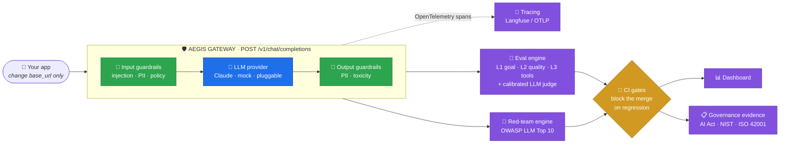

<div align="center">

# 🛡️ Aegis

### The safety & quality control layer for LLM apps and AI agents

**English** · [Español](README.es.md)

[](https://github.com/marcosmatalab/aegis/actions/workflows/ci.yml)
[](#numbers)
[](https://github.com/marcosmatalab/aegis/actions/workflows/ci.yml)
[](docs/redteam.md)
[](LICENSE)
<br/>


**[🎬 Demo](#demo) · [📊 Live dashboard](https://marcosmatalab.github.io/aegis/) · [🚀 Quickstart](#quickstart) · [🏗️ Architecture](#how-it-works) · [📚 Docs](#documentation)**

</div>

---

## 💡 What it does, in plain words

Aegis sits **between your application and the AI model**. You change one setting (the API
URL), switch on the guardrails you want, and from then on every request is protected and
measured:

| | Step | What happens |
|:-:|---|---|
| 🧱 | **Protect** | Screens every prompt for injection attacks and redacts personal data (emails, phone numbers, credit cards, Spanish DNI) *before* it reaches the model. |
| 🧪 | **Measure** | Grades whether the AI agent actually completed its task: the final answer, the reasoning, and every tool call it made along the way. |
| 🎯 | **Attack** | Runs a catalog of real-world attacks (OWASP LLM Top 10) against its own defences and reports what was stopped. |
| 🚦 | **Block** | Runs in CI on every pull request. If quality or security drops, **the merge is blocked**, with the exact failing case named. |
| 📋 | **Prove** | Produces an evidence report mapped to the **EU AI Act, NIST AI RMF and ISO 42001**, plus a dashboard of every result. |

> **In one line:** a drop-in, OpenAI-compatible gateway that makes an LLM app *safer*,
> *measurable*, and *impossible to regress silently*.

---

## 📈 Key metrics

<div align="center">

| 🧪 Tests | 📐 Coverage | 🤝 Judge vs. humans | 🎯 Attacks detected | ⭐ Eval score | 🚦 Required CI checks |
|:-:|:-:|:-:|:-:|:-:|:-:|
| **958** | **96%** branch | **κ 0.933** | **18/25** | **0.861** | **6** on `main` |
| offline, keyless | enforced ≥ 95% | Cohen's kappa, N=30 | OWASP LLM 2025 | over 32 golden cases | merge-blocking |

</div>

Every figure is **recomputed by the test suite from a committed artifact**. If a number on this
page ever drifts from the code, CI goes red. [How to reproduce each one ↓](#numbers)

---

<a id="demo"></a>

## 🎬 Demo


<sub>Rendered from the **real output** of an offline run
([`scripts/capture_demo.sh`](scripts/capture_demo.sh) → [`scripts/render_demo_gif.py`](scripts/render_demo_gif.py)).
Every number on screen was printed by the tool itself, and the gate FAIL is a genuine regression.</sub>

One script, [`scripts/demo.sh`](scripts/demo.sh), drives the whole system end to end in ten
beats:

```text
gateway up → OpenAI-style call → PII redacted → injection blocked → eval run
  → judge κ recomputed → eval gate PASS → tampered baseline FAIL → red-team run
  → evidence report → live dashboard
```

---

## 📊 Dashboard

A read-only Next.js dashboard renders the real reports. **[Open the live version →](https://marcosmatalab.github.io/aegis/)**

<table>
  <tr>
    <td width="50%" align="center"><br/><sub><b>Evals:</b> L1 / L2 / L3 scores per run</sub></td>
    <td width="50%" align="center"><br/><sub><b>Red-team:</b> detection per OWASP category</sub></td>
  </tr>
  <tr>
    <td colspan="2" align="center"><br/><sub><b>Judge calibration:</b> agreement with human labels</sub></td>
  </tr>
</table>

---

<a id="how-it-works"></a>

## 🏗️ How it works


```mermaid
flowchart LR
    app(["📱 Your app<br/><i>change base_url only</i>"])

    subgraph gw["🛡️ AEGIS GATEWAY · POST /v1/chat/completions"]
        direction LR
        gin["🧱 Input guardrails<br/>injection · PII · policy"]
        llm["🤖 LLM provider<br/>Claude · mock · pluggable"]
        gout["🧱 Output guardrails<br/>PII · toxicity"]
        gin --> llm --> gout
    end

    app --> gw
    gw -. "OpenTelemetry spans" .-> otel["🔭 Tracing<br/>Langfuse / OTLP"]

    gw --> ev["🧪 Eval engine<br/>L1 goal · L2 quality · L3 tools<br/>+ calibrated LLM judge"]
    gw --> rt["🎯 Red-team engine<br/>OWASP LLM Top 10"]
    ev --> gate{"🚦 CI gates<br/>block the merge<br/>on regression"}
    rt --> gate
    gate --> dash["📊 Dashboard"]
    gate --> gov["📋 Governance evidence<br/>AI Act · NIST · ISO 42001"]

    classDef core fill:#1f6feb,stroke:#0b3d91,color:#fff
    classDef guard fill:#2ea44f,stroke:#1a7f37,color:#fff
    classDef gate fill:#d29922,stroke:#9a6700,color:#fff
    classDef out fill:#8250df,stroke:#5a32a3,color:#fff
    class llm core
    class gin,gout guard
    class gate gate
    class ev,rt,dash,gov,otel out
```

**Evaluation at three levels:** Aegis scores more than the final answer.

| Level | Question it answers | Example signal |
|---|---|---|
| **L1 · Session** | Did the agent achieve the user's goal? | goal completion |
| **L2 · Trace** | Was the reasoning sound and the answer good? | G-Eval-style chain-of-thought judge |
| **L3 · Tool** | Did it call the right tools, with the right arguments, in the right order? | trajectory accuracy, tool correctness, progress rate |

The LLM judge is **validated against hand-labelled human verdicts** (Cohen's κ 0.933), so the
scores are anchored to human judgement rather than taken on trust.

---

## 🧠 Engineering highlights

The design decisions behind the project, all of them mine:

- 🚦 **Regression gates as contracts.** I defined exactly what counts as a regression for each
  gate and committed the baselines as reviewable contracts. The only green path past a real
  regression is an explicit, visible re-baseline in the PR diff.
- 🤝 **A judge you can check.** I hand-labelled the 30-case calibration set and published every
  per-case verdict, so anyone can recompute the judge's agreement offline, with no API key.
- 🎯 **Honest security coverage.** I mapped the attack catalog to the OWASP LLM Top 10 2025, and
  the red-team gate fails the build on any attack that used to be stopped and now gets through.
- 🔌 **Drop-in by design.** The gateway is OpenAI-compatible (including SSE streaming), and the
  guardrails are a **byte-identical passthrough when off**, so it can be adopted incrementally.
- 🧩 **Enforced architecture.** Layer boundaries are enforced by `import-linter` in CI,
  type-checked with `mypy`, with pluggable `Provider` / `Judge` interfaces.
- ♻️ **Fully reproducible.** Deterministic keyless mocks, a locked dependency set (`uv.lock`), a
  Python 3.12 + 3.13 matrix, and a CI that needs no API key and no network.

---

<a id="numbers"></a>

## 🔢 The numbers, and how to reproduce them

Each figure has a **committed artifact** and a command that regenerates it in about a second,
**offline and without an API key**.

| What | Result | Reproduce | Source of truth |
|---|---|---|---|
| 🎯 Red-team detection (OWASP catalog) | **18/25 = 0.720**; the 7 remaining gaps are named in the report | `aegis redteam run` | `src/aegis/redteam/baselines/redteam.json` |
| ⭐ Eval suite (golden set) | **overall 0.861** (L1 0.854 · L2 0.856 · L3 0.872) | `aegis eval run` | `src/aegis/evals/baselines/golden.json` |
| 🤝 Judge agreement with human labels | **Cohen's κ 0.933**, p_o 0.967, N=30 | `aegis calibrate --from-verdicts artifacts/calibration-geval-2026-09-22.jsonl` | [`artifacts/…jsonl`](artifacts/calibration-geval-2026-09-22.jsonl) |
| 🧪 Test suite | **958 passed, 4 skipped**, 96% branch coverage | `pytest -q --cov --cov-branch` | CI, `--cov-fail-under=95` |

---

<a id="quickstart"></a>

## 🚀 Quickstart

**Requires Python 3.12+.**

```bash
git clone https://github.com/marcosmatalab/aegis.git && cd aegis
python3.12 -m venv .venv && source .venv/bin/activate   # Windows: .venv\Scripts\activate
pip install -e ".[dev]"

pytest -q                 # 958 tests, ~10s, fully offline
bash scripts/demo.sh      # the whole pipeline end to end, ~23s
```

**The three headline numbers, in about three seconds:**

```bash
aegis redteam run         # 25 OWASP attacks vs the guardrails
aegis eval run            # 32 golden cases, L1 / L2 / L3
aegis calibrate --from-verdicts artifacts/calibration-geval-2026-09-22.jsonl
```

**Run the gateway** (keyless mock by default; switch to Claude with one environment variable, see
[`docs/provider-anthropic.md`](docs/provider-anthropic.md)):

```bash
uvicorn aegis.gateway.main:app --port 8080
# or:  docker build -t aegis . && docker run --rm -p 8080:8080 aegis

curl http://localhost:8080/v1/chat/completions \
  -H "Content-Type: application/json" \
  -d '{"model":"mock/echo-1","messages":[{"role":"user","content":"hello"}]}'
```

Any OpenAI client works unchanged: point its `base_url` at `http://localhost:8080/v1`.

---

<a id="ci-regression-gates-f7"></a>

## 🚦 CI quality gates

Every job is **blocking, offline and keyless**, and all six are **required status checks on
`main`**: a regression does not just turn red, it **blocks the merge**. The live protection
settings are exported and committed in [`docs/branch-protection.json`](docs/branch-protection.json).

| Check | What it guarantees |
|---|---|
| 🚦 `aegis eval gate` | No eval regression vs the committed baseline, reported case by case |
| 🎯 `aegis redteam gate` | No red-team regression vs the committed baseline, reported attack by attack |
| 🤝 `aegis calibrate --from-verdicts` | The published κ always matches its committed artifact |
| 🧪 `pytest --cov-fail-under=95` | Functional correctness, with a coverage floor |
| 🔍 `ruff` · `mypy` · `lint-imports` | Style, strict types, and architectural layering |
| 📊 Biome · `tsc` · Vitest · `next build` · `npm audit` | Dashboard lint, types, tests, build and dependency advisories |

Full gate contracts: [`docs/ci-gates.md`](docs/ci-gates.md).

---

## 🧰 Tech stack

| Layer | Technology |
|---|---|
| 🌐 Gateway | FastAPI + uvicorn, OpenAI-compatible, SSE streaming |
| 🤖 Providers | Anthropic Claude (optional `[anthropic]` extra), deterministic keyless mock, pluggable `Provider` interface |
| 🧱 Guardrails | Deterministic regex/lexicon scanners; Microsoft **Presidio** optional for richer PII |
| 🧪 Evals | G-Eval-style CoT judge, 3-level + trajectory metrics, CLEAR, Agent-as-a-Judge |
| 🎯 Red-team | Committed attack catalog mapped to OWASP LLM Top 10 2025 |
| 🔭 Observability | OpenTelemetry GenAI semantic conventions → OTLP / Langfuse |
| 📊 Dashboard | Next.js + React + Recharts, published on GitHub Pages |
| 📋 Governance | `fpdf2` evidence PDF + JSON, mapped to EU AI Act Art.15 / NIST AI RMF / ISO 42001 |
| ⚙️ CI/CD | GitHub Actions, `uv.lock`, Python 3.12 + 3.13 matrix, Docker, Dependabot |

---

<a id="documentation"></a>

## 📚 Documentation

| | Topic |
|:-:|---|
| 🧱 | [Guardrails](docs/guardrails.md): injection, PII, policy, toxicity |
| 🧪 | [Evals, trajectory & judge calibration](docs/evals.md) |
| 🎯 | [Red-team](docs/redteam.md): the OWASP catalog and per-category results |
| 🚦 | [CI gates](docs/ci-gates.md): what counts as a regression |
| 🤖 | [Real provider](docs/provider-anthropic.md): plugging in Claude |
| 🔭 | [Observability](docs/observability.md) · 📋 [Governance](docs/governance.md) · 📊 [Dashboard](docs/dashboard.md) · 🗺️ [Roadmap](docs/roadmap.md) |

📝 Scope, caveats and known limitations are documented in [`docs/limitations.md`](docs/limitations.md).
🛠️ Built June–September 2026; how it was built and the contribution guidelines are in [`CONTRIBUTING.md`](CONTRIBUTING.md).

---

<div align="center">

### 👤 Author

**Marcos Mata García** · AI / Platform Engineer · Madrid, Spain

[](https://linkedin.com/in/marcosmatagarcia)
[](https://github.com/marcosmatalab)
[](mailto:matagarciamarcos@gmail.com)

<sub>Open to AI / platform engineering roles.</sub>

[MIT](LICENSE) © 2026 Marcos Mata García

</div>
